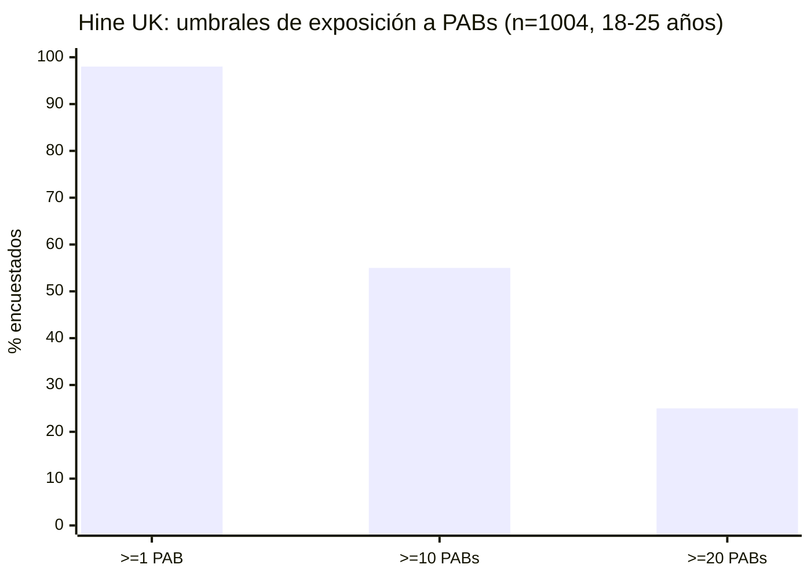
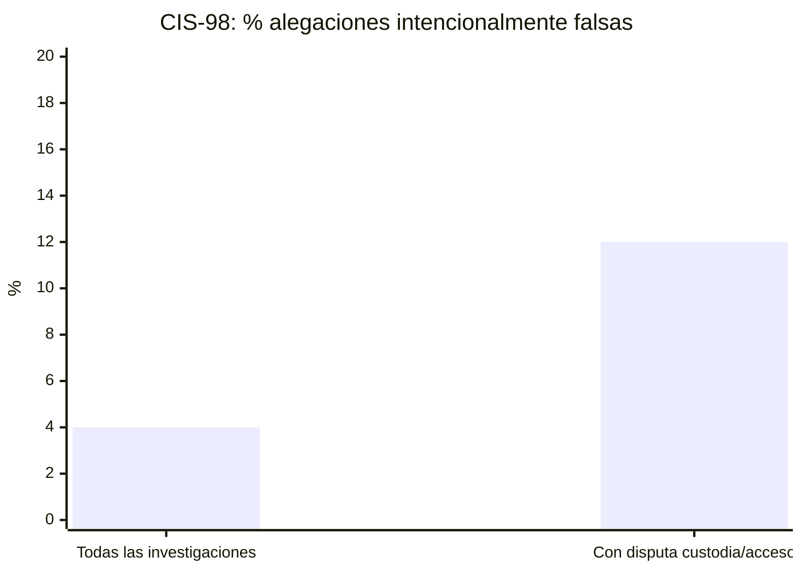
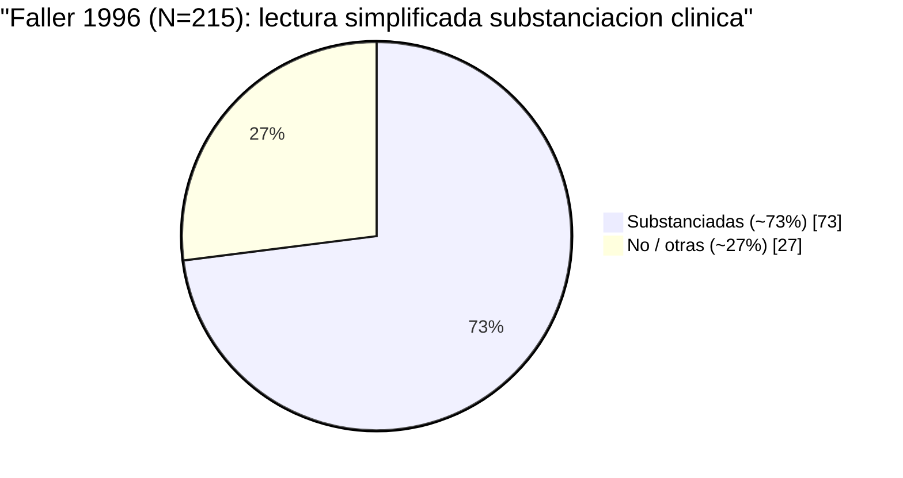
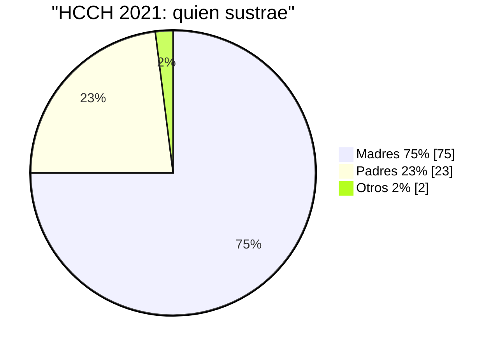
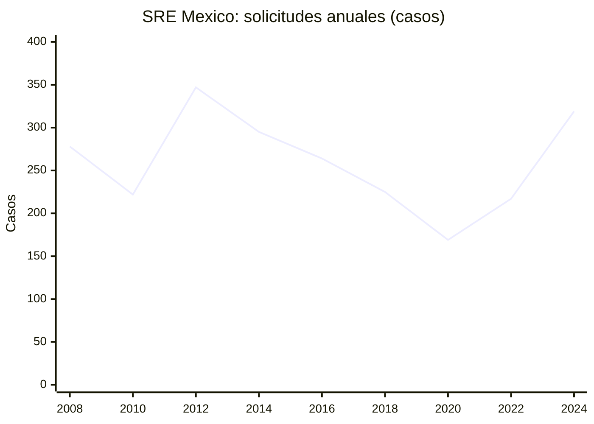
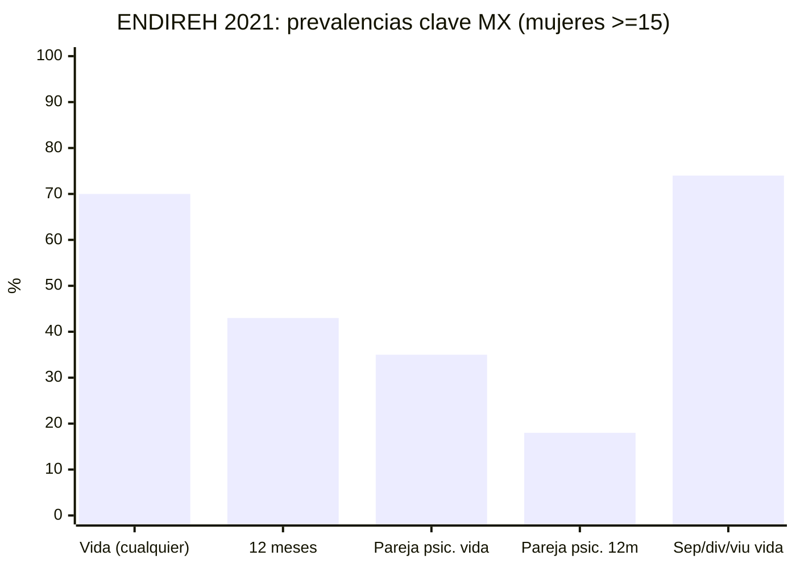
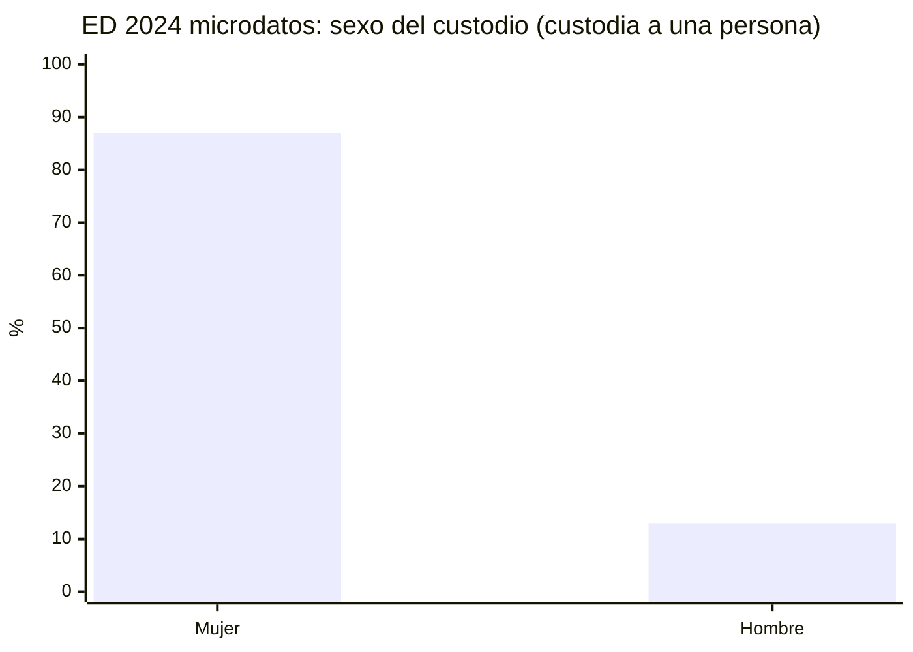
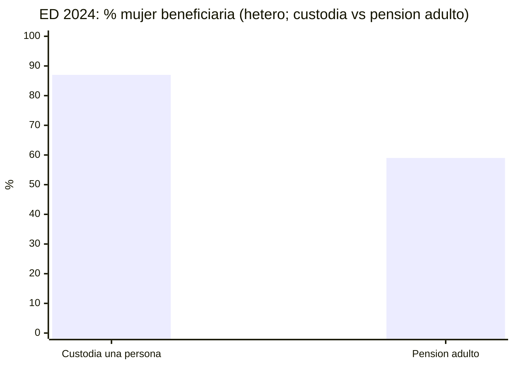
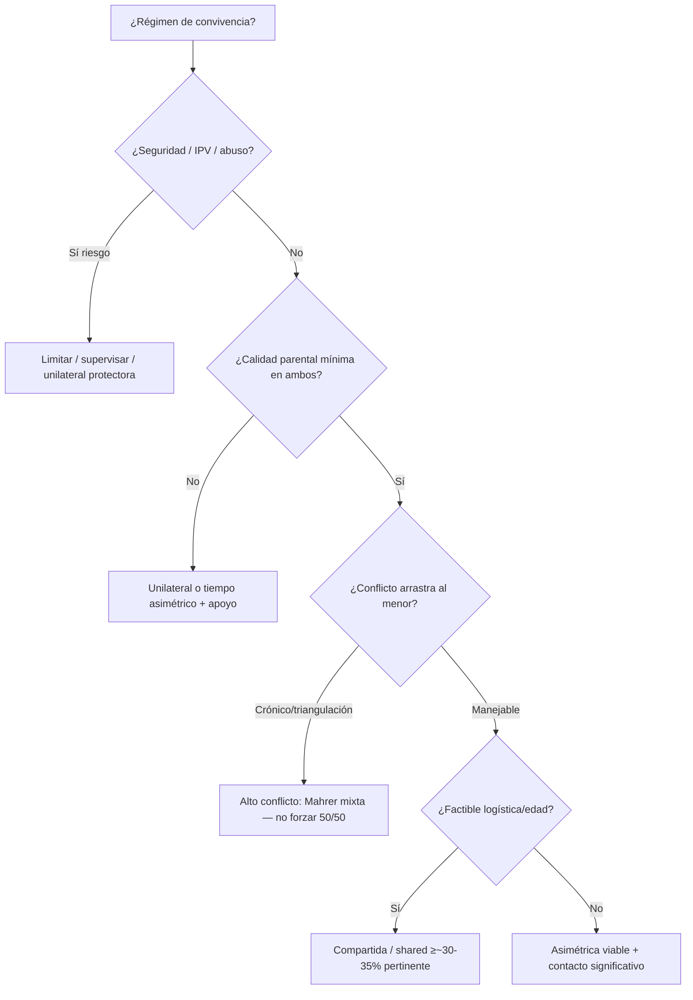
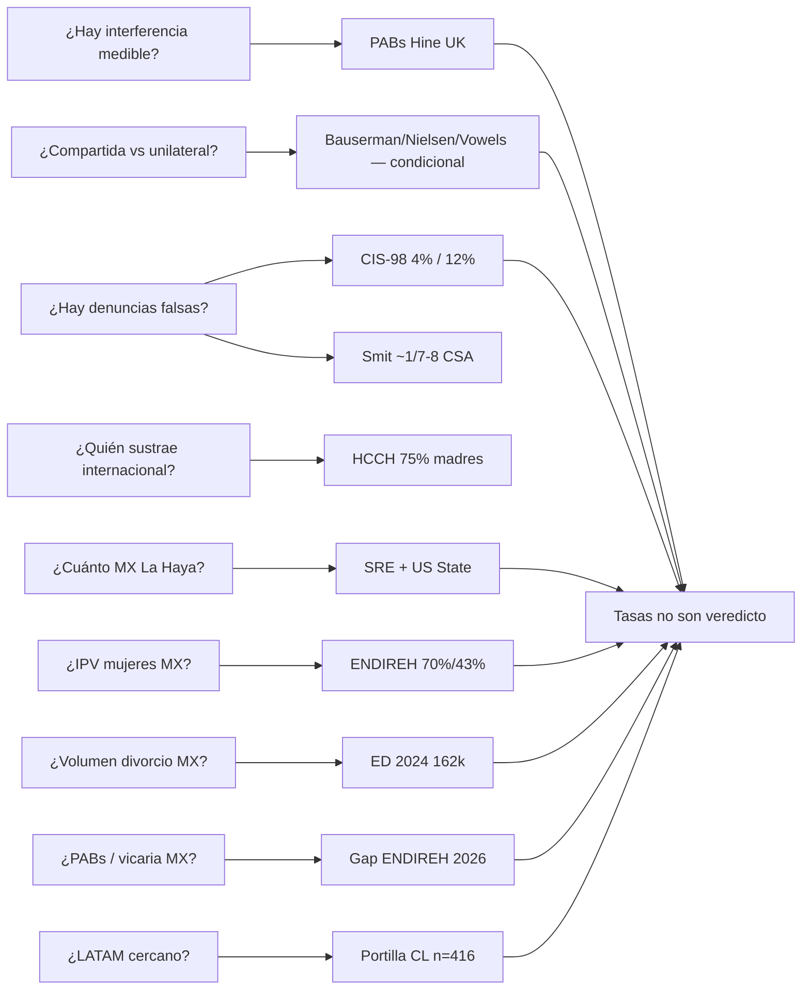

# Capítulo 1.3. Mapa estadístico: prevalencia, base rates y límites de la evidencia

<!-- sync:version-badge -->
> **v1.12** · conocimiento **103** · actualizado **2026-09-20**
<!-- /sync:version-badge -->

## Resumen ejecutivo

Tras la genealogía ([[Cap-01-01-Genealogia-SAP-Interferencia-Vicaria|Capítulo 1.1. Genealogía crítica: Del SAP (Gardner) a la Interferencia Parental y la Violencia Vicaria]]) y el marco CDN/neuro ([[Cap-01-02-Redefinicion-CDN-Neurociencia|Capítulo 1.2. Redefinición operativa: Derechos del Niño y neurociencia del apego]]), este capítulo **concentra cifras** con cautela: PABs (Hine UK), alegaciones (CIS/Smit/Faller), **pack MX** (ENDIREH + ED 2024 + SRE/US State + EVIPAR + LGDNNA; gap PABs/vicaria), HCCH, Portilla (CL), **esqueleto comparativo** UK/CA/CL/US/ES/DE (§2.7) y **custodia compartida vs unilateral** con lectura de **pertinencia condicional** (§2.8: Bauserman/Baude/Nielsen/Vowels + Nordics + caveats IPV/alto conflicto). Cada gráfica lleva fuente: **agregados ≠ expediente**; tasas ≠ veredicto; Meland dual.

Canvas interactivo: [Mapa estadístico VF](/home/drds/.cursor/projects/home-drds-Documentos-Childer/canvases/mapa-estadistico-vinculos.canvas.tsx).

## Pregunta guía

¿Qué números existen —y qué **no** demuestran— sobre interferencia parental, denuncias instrumentales, IPV/divorcio MX y sustracción internacional en el corpus de *Vínculos Fracturados*?

---

## 1. Marco y definiciones

| Concepto | Qué mide | Qué **no** mide |
|----------|----------|-----------------|
| **PAB** (≥1 de N conductas) | Exposición reportada a conductas de denigración/interferencia | Alienación «grave» clínica ni veredicto forense |
| **Alegación infundada / falsa** | Criterio heterogéneo según estudio (intencional vs. no substanciada) | Tasa MX; mala fe por sexo |
| **Taking person (La Haya)** | Quién traslada/retiene en solicitudes a Autoridades Centrales | Culpa moral ni excepción art. 13 |
| **Solicitud SRE / US State ICA** | Flujo bilateral a Autoridades Centrales | Delito penal ni stock de litigio doméstico |
| **ENDIREH / EVIPAR** | IPV / control coercitivo (mujeres; EVIPAR ♀/♂) | PABs ni «violencia vicaria» como constructo (aún) |
| **ED (divorcios)** | Volumen y custodia administrativa MX | Sexo del custodio; PABs; alegaciones |
| **Advocacy (FNVV)** | Señales de litigio / tipificación | Prevalencia nacional probabilística |

**Doble riesgo (Meland):** no silenciar IPV real ni negar instrumentalización ([@meland2026love]; [[2026-Meland-parental-alienation-conditioned-love]]).

---

## 2. Evidencia documental (estadística)

### 2.1 PABs — prevalencia reportada (UK)

Hine et al.: encuesta representativa UK, **n=1.004** jóvenes 18–25 años, 30 PABs ([@hine2026pab]; [[2026-Hine-Harman-PAB-prevalence-UK-young-adults]]).

| Umbral | Aprox. |
|--------|-------:|
| ≥1 PAB | **98,3%** |
| ≥10 PABs | **>50%** |
| ≥20 PABs | **~25%** |

**Lectura:** el umbral ≥1 es **amplio** (no = epidemia de alienación grave). El patrón útil es **dosis → malestar** (rechazo, TEPT, depresión, ideación suicida). Puente: [[Cap-02-02-Evaluacion-Medicion-PABs|Capítulo 2.2. Evaluación y medición: comportamientos parentales alienantes, escalas y peritaje]].

### 2.2 Alegaciones de abuso en separación / divorcio

#### Figura — CIS-98 Canadá (Trocmé & Bala)

Investigaciones de maltrato reportado ([@anon2005falseallegat]; [[2005-Anon-false-allegations-of-abuse-and-neglect-when-p]]):

| Contexto | Intencionalmente fabricadas |
|----------|----------------------------:|
| Todas las investigaciones CIS-98 | **4%** |
| Submuestra con disputa de custodia/acceso | **12%** |
| No substanciadas (todas) | **>33%** (≠ fabricadas) |

Quienes fabrican con más frecuencia en esa submuestra: denunciantes anónimos y progenitores **no custodios** (suele ser el padre). Custodios (suele ser la madre) e hijos: menos frecuentes como fabricadores.

#### Figura — CSA × divorcio (Smit; Faller)

| Fuente | Hallazgo (cautela) |
|--------|-------------------|
| Smit et al. 2015 | ~**1/7–8** alegaciones CSA en divorcio **no fundadas** (lit. escasa/antigua) ([@smit2015betweenscyll]) |
| Faller & DeVoe 1996 (N=215 clínica) | Substanciación clínica **~72,6%**; judicial ~mitad; falsas adultas N=31 + posibles 14 + falsas infantiles 9 — **entre** otras clases ([@faller1996allegations]) |
| SAID (Blush & Ross 1987) | Opinión tipológica **sin** base rate validada ([@blush1987sexualalleg]) |
| Crítica de frecuencia | Métodos heterogéneos ([@anon2018thefrequency]; Meier género×alegaciones [@meier2017mappinggende]) |

**Regla:** no substanciada ≠ falsa intencional; SAID ≠ epidemiología. Detalle: [[Cap-04-03-IPV-Custodia-Denuncias|Capítulo 4.3. Violencia de pareja, custodia y denuncias: protección, instrumentalización y doble riesgo]] · [[Cap-05-01-Asimetrias-Denuncia-Dogma|Capítulo 5.1. Asimetrías punitivas, denuncia instrumental y dogma de política pública]].

### 2.3 Sustracción internacional — HCCH (global) y corredor MX–EE.UU.

#### HCCH 2021 — *taking person*

([@hcch2023globalreport]; [[2023-HCCH-global-report-1980-abduction-applications-2021]])

| Dimensión | 2021 |
|-----------|-----:|
| Madres / padres / otros | 75% / 23% / 2% |
| Primario o conjunto | **88%** (madres 94% · padres 71%) |
| Edad media del menor | 6,7 años |

#### SRE México + US State (CY 2024)

([@sre2024sustraccion]; [[2024-SRE-sustraccion-restitucion-internacional-menores-mexico]]; [@usstate2025mexicoica]; [[2025-US-State-ICA-Mexico-CY2024]]; `03-Datos/sre-restitucion/`)

**Suma 2008–2024 (SRE):** 4 564 solicitudes · 6 580 menores. Pico 2012; valle 2020. Destino/procedencia dominante: **Estados Unidos**.

| Stock activo SRE | Casos | Menores |
|------------------|------:|--------:|
| Desde México | 291 | 385 |
| Hacia México | 187 | 241 |
| **Total** | **478** | **626** |

**US State CY 2024 (México):** ~100 casos *return* / 137 menores en el año; ~47% resueltos; 50 abiertos a fin de año; Autoridad Central descrita como productiva ([@usstate2025mexicoica]).

**Gap MX:** sexo del sustractor **no** en CSV SRE → tipología = HCCH. Perfiles OJJDP: [[Cap-04-02-Jurisprudencia-Mexicana-SCJN|Capítulo 4.2. Jurisprudencia mexicana (SCJN): custodia, violencia familiar e interés superior]] ([@johnston2001familyabdu]).

### 2.4 México — pack estadístico (lo que sí / lo que no)

#### 2.4a ENDIREH 2021 — IPV mujeres (oficial)

([@inegi2021endireh]; [[2021-INEGI-ENDIREH-violencia-mujeres-mexico-nacional]]; n viviendas **140 784**)

| Indicador | Cifra |
|-----------|------:|
| Violencia (cualquier) — vida | **70,1%** |
| Idem — 12 meses | **42,8%** |
| Pareja — psicológica (vida relación) | **35,4%** |
| Pareja — psicológica (12 meses) | **18,4%** |
| Separadas / divorciadas / viudas — ≥1 (vida) | **74,0%** |
| Piden apoyo o denuncian (ámbito pareja) | **27,7%** |

**No mide:** PABs, interferencia parental validada, ni «violencia vicaria» como constructo. ENDIREH 2026 **propone** módulo vicaria/custodia ([@inegi2025endireh26]) —hasta resultados, **no inventar %**.

#### 2.4b Estadística de Divorcios 2024 — denominador litigio + custodia×sexo

([@inegi2024ed]; [[2024-INEGI-Estadistica-Divorcios-ED]]; microdatos `03-Datos/inegi-divorcios/`)

| Indicador ED 2024                       |                                          Cifra |
| --------------------------------------- | ---------------------------------------------: |
| Divorcios                               |    **161 932** (89,6% judicial / 10,4% admin.) |
| Matrimonios                             | 486 645 → **33,3** divorcios / 100 matrimonios |
| Causa: incausado / mutuo                |                                  67,2% / 31,3% |
| Judiciales con 1 / 2 / >2 menores       |                           22,5% / 16,2% / 5,5% |
| Judiciales **sin** menores dependientes |                                      **55,1%** |
| Custodia a una / ambas / ninguna (boletín) |                        38,2% / 5,9% / 55,1% |
| Patria potestad a ambas (aprox.)        |                                          38,5% |
| Pensión a hijas/os                      |                                          38,6% |

**Custodia × sexo (microdatos CSV — cierra el gap del boletín):** cuando la custodia se asigna a **un** divorciante (`custodia` = divorciante 1 o 2; n=**55 470**), el sexo de quien la recibe es:

| Sexo del custodio |      n |      % |
| ----------------- | -----: | -----: |
| Mujer             | 48 482 | **87,4%** |
| Hombre            |  6 988 | **12,6%** |

**Por entidad / municipio:** `03-Datos/inegi-divorcios/agregados/` (`custodia_por_entidad.csv`, `custodia_por_municipio.csv`). Geografía = lugar de **registro**. Rango estatal del % mujer (custodia a una persona): ~75–98% en la mayoría; **Puebla outlier** (~28% mujer) — alerta de calidad/captura, no conclusión substantive sin auditoría.

**Pensión alimenticia × sexo (beneficiario, no pagador):** variable `pension` = a quién se **asigna**. Códigos: hijos / divorciante 1|2 / ninguno / hijos+divorciante / N/A.

| Indicador pensión (n=161 932) | n | % |
|-------------------------------|--:|--:|
| Hijos (solo) | 55 987 | 34,6% |
| Ninguno | 75 466 | 46,6% |
| Hijos + divorciante 1\|2 | 8 106 | 5,0% |
| Solo divorciante 1\|2 | 1 493 | 0,9% |
| No aplica / NE | 20 880 | 12,9% |

Cuando hay **adulto** beneficiario (`pension` ∈ {2, 3, 12, 13}; n=**9 599**):

| Sexo adulto beneficiario | n | % |
|--------------------------|--:|--:|
| Mujer | 6 129 | **63,9%** |
| Hombre | 3 470 | **36,1%** |

Entre divorcios **con hijos menores** (n=64 093): el **100%** tiene pensión que incluye hijos; el adulto adicional aparece en ~12,6% (n=8 102) → **58,9%♀ / 41,1%♂** (menos sesgado que custodia 87%♀).

Tablas: `pension_nacional.csv`, `sexo_pension_adulto_nacional.csv`, `pension_por_entidad.csv`, `pension_por_municipio.csv`.

**Hetero vs mismo sexo** (`t_dvante`):

| Tipo          |       n | % total | Con menores | Custodia→una (sexo)        | Pensión adulto (sexo)     |
| ------------- | ------: | ------: | ----------: | -------------------------- | ------------------------- |
| Hetero H–M    | 161 249 |  99,58% |      64 046 | 87,4%♀ / 12,6%♂ (n=55 431) | 58,9%♀ / 41,1%♂ (n=8 102) |
| Mismo sexo HH |     244 |   0,15% |       **9** | 8♂ (n=8)                   | — (n=0)                   |
| Mismo sexo MM |     439 |   0,27% |      **38** | 31♀ (n=31)                 | 4♀ (n=4)                  |

**Lectura:** (1) custodia unilateral es **fuertemente** materna en hetero; pensión al adulto es **moderada**. (2) mismo sexo = **≪1%** del archivo y casi sin menores → **no** comparar % con hetero como si fueran tasas estables. (3) en HH/MM el sexo del custodio es tautológico (ambos del mismo sexo). Detalle: `comparativo_hetero_vs_mismo_sexo.csv`.

**Factores sociodemográficos — compartida vs una persona:** INEGI **no** publica un modelo causal; el boletín solo describe sexo/edad/escolaridad/actividad de quienes se divorcian. Sobre microdatos ED 2024, universo = divorcios con hijos menores y custodia asignada a 1, 2 o ambos (n≈64 017): **13,4% compartida** / 86,7% una persona.

| Factor (asociación descriptiva) | Hallazgo | OR crudo (aprox.) |
|--------------------------------|----------|-------------------|
| **Entidad federativa** | Dominante: Puebla ~38% vs Sinaloa ~2% | vs CDMX: Puebla ~4,4 · Sinaloa ~0,13 |
| Nº hijos menores | Más hijos → más compartida | 4+ vs 1: **1,7** |
| Edad (div1) / duración matrimonio | Mayores / uniones largas → más compartida | 55+ vs 25–34: **1,8** · 21+a vs 0–5a: **1,4** |
| Escolaridad máxima del par | Superior **no** eleva compartida (~12%); «baja»/técnica-otra sí (posible ruido de captura) | superior vs media: ~1,0 |
| Ambos trabajan | Ligera **menor** compartida | **0,87** |
| Quién inició el juicio | Solo divorciante 2 → menos compartida | vs div1: **0,70** |
| Orden sexo en acta (H–M vs M–H) | H–M asocia a más compartida | **1,5** (posible artefacto de captura, no «preferencia») |

Tablas: `custodia_compartida_factores.csv`, `custodia_compartida_OR.json`. **No causal** (sin ajuste multivariado pleno; la entidad absorbe gran parte de la varianza). Puebla sigue siendo outlier de calidad.

**Lectura Meland:** sesgo materno de custodia/pensión en ED = **hecho administrativo**, no prueba de PABs. «No se otorga» (~49% del total) cruza con `hij_men=0`.

#### 2.4c Instrumento MX — EVIPAR / control coercitivo (no PABs)

([@evipar2023mexico]; [[2023-EVIPAR-S-violencia-pareja-control-coercitivo-Mexico]])

Escala de violencia de pareja validada en mexicanos (♀/♂) con dimensión de **control coercitivo** (limitar familia/tiempo). Mide IPV 12 meses —**no** alienación. Útil para Cap-03-04 y para no importar solo escalas anglosajonas.

#### 2.4d Marco normativo de convivencia (no tasa)

([@lgdnna2014convivenci]; [[2014-LGDNNA-Mexico-convivencia-familias-separadas-art23]])

LGDNNA art. 23: NNA de familias separadas tienen derecho a convivencia regular salvo orden judicial. Ancla CDN; la escuela no crea régimen (Cap-07).

#### 2.4e Vicaria tipificada / advocacy — no confundir con epi

([@fnvv2022encuestavic]; [[2022-FNVV-Encuesta-Victimas-Vicaria]])

Encuesta FNVV 2022 (n=3 008 mujeres auto-identificadas; conveniencia): claims de procesos legales cruzados. Prensa/transparencia: ~609 denuncias penales por vicaria y **0** sentencias; tipificación desigual entre entidades. **Advocacy ≠ ENDIREH.** Meland: ancla el polo IPV (*Arrancamiento* Cap-06) sin negar PABs.

#### 2.4f PABs en México — gap + hoja de ruta

| Pregunta | Respuesta | Acción |
|----------|-----------|--------|
| ¿% PABs nacional MX? | **Desconocido** | No usar ENDIREH 70% ni Hine UK como proxy |
| ¿Algún estudio MX empírico? | Solo local/bajo: Acevedo Saltillo n=150 ([@acevedo2020alienacionsaltillo]) —«algunas» familias, sin % nacional; marco SAP | No generalizar |
| ¿Escala MX? | Pérez Agüero & Andrade 2013 (TSJDF/UNAM) — psicometría SAP, **no** prevalencia ([[2017-Saldana-cuestionario-alienacion-parental-padres-divorciados]]) | Adaptar PAB-style (Hine) / Saldaña/Gomide ([[Cap-02-02]]) |
| ¿Vicaria tipificada = prevalencia? | No | Esperar ENDIREH 2026 |
| ¿Diseño viable? | — | (1) Hine-like 18–25 probabilístico; (2) módulo ENDIREH/ENVIPE; (3) cohortes forenses ≠ tasa poblacional |

**Regla:** declarar el gap es evidencia; inventar el % no lo es. LATAM cercano (distress≠tasa): Portilla Chile ([@portilla2023psychologic]).

### 2.8 Custodia compartida vs unilateral — pertinencia condicional

Oleada 2026-09-20: ~85 trabajos (meta/sysrev + Nordics + doctrina ES) ingeridos al vault. Lectura del libro: **la compartida no es dogma ni tabú**; es **pertinente si** seguridad + calidad parental + conflicto manejable + factibilidad. Los calendarios de convivencia **mínima** (fines de semana alternos) no tienen meta-análisis que los declare óptimos en general: suelen ser default histórico, no diseño validado.

#### 2.8a Qué sí muestra la evidencia (agregados)

| Fuente | Diseño | Hallazgo útil | Límite |
|--------|--------|---------------|--------|
| Bauserman 2002 ([@bauserman2002childadjustm]; [[2002-Bauserman-child-adjustment-in-joint-custody-versus-sole]]) | Meta joint vs sole | Mejor ajuste en joint (general, emocional, vínculo, autoestima); no se explica solo por menor conflicto | Observacional; joint legal ≠ joint physical |
| Bauserman 2012 ([@bauserman2012ametaanalysi]; [[2012-Bauserman-a-meta-analysis-of-parental-satisfaction-adju]]) | Meta padres | Más satisfacción / menos conflicto reportado en joint | Autoinforme parental |
| Baude et al. 2016 ([@baude2016childadjustm]; [[2016-Baude-child-adjustment-in-joint-physical-custody-ve]]) | Meta 19 est. (30–50% tiempo) | Ventaja joint **débil** (*d*≈0,11); modera el % de tiempo | Efecto pequeño |
| Nielsen 2014 (~40) ([@nielsen2014sharedphysic]; [[2014-Nielsen-shared-physical-custody-summary-of-40-studies]]) | Narrative review ≥35% | Mejor o igual en bienestar, salud, vínculo; a menudo con conflicto alto | No meta formal; selección de estudios |
| Nielsen 2018 (~60) ([@nielsen2018jointversuss]; [[2018-Nielsen-joint-versus-sole-physical-custody-children-s]] · [@nielsen2018jointversuss2]; [[2018-Nielsen-joint-versus-sole-physical-custody-outcomes-f]]) | Narrative 60 | JPC ≥ SPC en la mayoría; subset independiente de ingreso/conflicto/calidad vínculo | Misma cautela de selección |
| Nielsen 2021 ([@nielsen2021jointversuss]; [[2021-Nielsen-joint-versus-sole-physical-custody-which-is-t]]) | Síntesis | Refuerza lectura «mejor o igual», no superioridad absoluta | Advocacy-adjacent tone → citar con límites |
| Vowels et al. 2023 ([@vowels2023systematicre]; [[2023-Vowels-systematic-review-and-theoretical-comparison]]) | Sysrev PLOS One | SPC suele ≥ LPC; compara también con familias intactas; teoría vs datos | Heterogeneidad; causalidad limitada |
| Steinbach 2018 lit. review ([@steinbach2018childrensand]; [[2018-Steinbach-children-s-and-parents-well-being-in-joint-ph]]) | Review bienestar | Bienestar niños/padres en JPC: patrón favorable con matices | Europa-centrado |
| Lamb 2018 ([@lamb2018doessharedpa]; [[2018-Lamb-does-shared-parenting-by-separated-parents-af]]) | Ensayo/síntesis | Shared parenting y ajuste en niños pequeños: argumento pro-implicación de ambos | No RCT |

**Nordics (muestras grandes, no causalidad forense):** Bergström et al. — dos hogares / salud mental / mudanzas frecuentes ([@bergstrom2013livingintwoh]; [[2013-Bergstrom-living-in-two-homes-a-swedish-national-survey]] · [@bergstrom2014mentalhealth]; [[2014-Bergstrom-mental-health-in-swedish-children-living-in-j]] · [@bergstrom2015fiftymovesay]; [[2015-Bergstrom-fifty-moves-a-year-is-there-an-association-be]]); Carlsund riesgo adolescente ([@carlsund2012riskbehaviou]; [[2012-Carlsund-risk-behaviour-in-swedish-adolescents-is-shar]] · [@carlsund2012sharedphysic]; [[2012-Carlsund-shared-physical-custody-after-family-split-up]]); Turunen autoestima ([@turunen2017selfesteemin]; [[2017-Turunen-self-esteem-in-children-in-joint-physical-cus]]); Fransson condiciones de vida ([@fransson2017thelivingcon]; [[2017-Fransson-the-living-conditions-of-children-with-shared]]); Hjern escolares ([@hjern2021mentalhealth]; [[2021-Hjern-mental-health-in-schoolchildren-in-joint-phys]]); Spruijt NL ([@spruijt2009jointphysica]; [[2009-Spruijt-joint-physical-custody-in-the-netherlands-and]]); Steinbach adolescentes 37 países ([@steinbach2020jointphysica]; [[2020-Steinbach-joint-physical-custody-and-adolescents-life-s]]) y horarios post-sep ([@steinbach2021postseparati]; [[2021-Steinbach-post-separation-parenting-time-schedules-in-j]]); Hakovirta Europa ([@hakovirta2023jointphysica]; [[2023-Hakovirta-joint-physical-custody-of-children-in-europe]]); Meyer US tendencia shared ([@meyer2022increasesins]; [[2022-Meyer-increases-in-shared-custody-after-divorce-in]]); Augustijn (estrés, vínculo, economía materna) ([@augustijn2021childrensexp]; [[2021-Augustijn-children-s-experiences-of-stress-in-joint-phy]] · [@augustijn2021jointphysica]; [[2021-Augustijn-joint-physical-custody-parent-child-relations]] · [@augustijn2021theassociati]; [[2021-Augustijn-the-association-between-joint-physical-custod]] · [@augustijn2021therelationb]; [[2021-Augustijn-the-relation-between-joint-physical-custody-i]] · [@augustijn2022mothersecono]; [[2022-Augustijn-mothers-economic-well-being-in-sole-and-joint]]).

#### 2.8b Condiciones (cuándo deja de ser pertinente)

1. **Seguridad / IPV.** Joint custody con violencia de pareja es riesgosa: Greenberg 2005 ([@greenberg2005domesticviol]; [[2005-Greenberg-domestic-violence-and-the-danger-of-joint-cus]]). Puente [[Cap-03-04-Control-Coercitivo-Familia|Capítulo 3.4. Control coercitivo, familia y custodia]] · [[Cap-04-03-IPV-Custodia-Denuncias|Capítulo 4.3. Violencia de pareja, custodia y denuncias: protección, instrumentalización y doble riesgo]].  
2. **Calidad parental > % de días.** O’Hara & Sandler: el *parenting time* beneficia vía calidad; el conflicto interparental empuja en contra ([@ohara2019parentingtim]; [[2019-OHara-Sandler-parenting-time-quality-conflict-child-mental-health]]).  
3. **Alto conflicto.** Mahrer et al.: shared parenting ¿ayuda o daña? — evidencia **mixta**, no receta ([@mahrer2018doessharedpa]; [[2018-Mahrer-does-shared-parenting-help-or-hurt-children-i]]). Puente [[Cap-03-03-Alto-Conflicto-Terapia-Reunificacion|Capítulo 3.3. Alto conflicto, terapia familiar y reunificación]].  
4. **Edad / pernoctas.** McIntosh et al. sobre overnights post-sep ([@mcintosh2013overnightcar]; [[2013-Mcintosh-overnight-care-patterns-following-parental-se]]) — debate apego/lactancia; no importar como veto universal ni como permiso automático.  
5. **Presunción 50/50 ciega.** Harris-Short critica la marcha hacia residencia igualitaria sin sopesar welfare ([@harrisshort2010resistingthe]; [[2010-Harris-Short-resisting-the-march-towards-50-50-shared-resi]]). Escobedo et al.: política de paternidad / shared residence ES–FR ([@escobedo2011thesocialpol]; [[2011-Escobedo-the-social-politics-of-fatherhood-in-spain-an]]).  
6. **México descriptivo ≠ outcome.** ED 2024: ~13% compartida (§2.4b) — volumen administrativo, **no** prueba de bienestar infantil. LGDNNA art. 23 = derecho a convivencia, no fórmula de días.

#### 2.8c Lectura operativa (libro)

**Prohibido en el vault:** (1) citar Nielsen/Bauserman como «prueba de que siempre compartida»; (2) usar ED 13% como outcome; (3) imponer compartida contra IPV; (4) tratar visitas mínimas como gold standard científico.

**Doctrina ES (contexto, no epi):** oleada de guarda/custodia compartida en literatura jurídica española (Vega, Castro, Martín-Calero, Cabello, Farina, Alba, Arraez, Lehmann, Costas, Molina, Tabasco, etc.) — útil para mapa Cap-04/05, **no** como meta-análisis de bienestar. Ver fichas 2005–2024 en `01-Fuentes/papers/`.

### 2.5 Síntesis visual — qué cifra para qué pregunta

### 2.6 Límites

- Ninguna tasa sustituye pericia + expediente ([[Cap-03-05-Evaluacion-Custodia-Forense|Capítulo 3.5. Evaluación de custodia y peritaje forense]]).
- Prevalencias UK/CA/NL/global **no** son tasa MX de PA/interferencia.
- ENDIREH = violencia contra mujeres, **no** alienación; ED = divorcios, **no** PABs; FNVV = advocacy.
- Umbral PAB ≥1 infla; umbral clínico exige instrumentos ([[Cap-02-02-Evaluacion-Medicion-PABs|Capítulo 2.2. Evaluación y medición: comportamientos parentales alienantes, escalas y peritaje]]).
- «No substanciada» ≠ «falsa intencional» (Trocmé).
- Compartida vs unilateral: ventaja agregada **débil/condicional**; no RCT de asignación; contraindicada con IPV (Greenberg) (§2.8).

### 2.7 Comparativo por país — mapa listo para llenar

Tabla de **estado del vault** (no inventar celdas vacías). Objetivo: misma pregunta en varias jurisdicciones con la misma disciplina Meland.

| País | PABs / interferencia | Alegaciones × divorcio | IPV / violencia pareja | Sustracción intl | Notas vault |
|------|---------------------|------------------------|------------------------|------------------|-------------|
| **MX** | **Gap** (Acevedo Saltillo n=150 baja; sin % nacional) | Gap (sin CIS-MX) | ENDIREH 2021 + EVIPAR | SRE + US State; sexo→HCCH | Pack §2.4; LGDNNA; **ED custodia×sexo 87%♀** |
| **UK** | Hine 2026 (n=1004) | — | — | HCCH (Parte) | Ancla PAB §2.1 |
| **CA** | — | CIS-98 Trocmé 4%/12% | — | HCCH | Alegaciones §2.2 |
| **CL** | Portilla 2023 (n=416 online; distress) | — | — | HCCH | LATAM cercano; **no** tasa nacional |
| **US** | — (Harman lit. en otros caps) | Meier género×family court | — | OJJDP + State ICA + HCCH | Corredor con MX |
| **ES** | Pendiente (LOPIVI veta SAP como tipicidad —Cap-05) | Pendiente | — | HCCH | Preparar: CIS-like / encuesta jóvenes |
| **DE** | Pendiente (BVerfG rechaza PAS —Cap-06 Talbusch) | Pendiente | — | HCCH / Meyer memoir | Preparar: Statistisches + family court |
| **JP** | — | — | — | Hague tardío; Galbraith Cap-06 | Cualitativo sustracción |
| **NL** | Smit CSA×divorcio | Smit | — | HCCH | §2.2 |

**Próximas oleadas sugeridas (no literarias):**
1. MX — auditar outlier Puebla en ED; protocolo PJCDMX como **operacional** no epi.  
2. ES — prevalencia PABs / alegaciones post-LOPIVI.  
3. DE — datos oficiales post-debate Entfremdung.  
4. US — meta-análisis Harman/Meier ya citados: tabla de tasas con advertencias.  
5. CA — actualización tipo CIS post-1998.

---

## 3. Falla institucional / sesgo ideológico

Dos abusos de la estadística: (1) usar 98% PABs como prueba de «todos alienan»; (2) usar 4% fabricadas como prueba de que «casi no hay instrumentalización en custodia» (olvida el 12% en disputa y el 1/7–8 de Smit). En MX: usar ENDIREH 70% como «prueba de alienación» o FNVV 3008 como «tasa nacional» comete el mismo error. El dogma elige el número que confirma el bando ([[Cap-05-01-Asimetrias-Denuncia-Dogma|Capítulo 5.1. Asimetrías punitivas, denuncia instrumental y dogma de política pública]]).

---

## 4. Impacto en el menor

Las cifras importan solo si reducen **tiempo de daño**: dosis de denigración (Hine), suspensión cautelar por alegación no investigada, o traslado internacional sin retorno (SRE/HCCH). El menor es la unidad de análisis ([[Cap-01-02-Redefinicion-CDN-Neurociencia|Capítulo 1.2. Redefinición operativa: Derechos del Niño y neurociencia del apego]] · [[Cap-02-01-Trauma-Ruptura-Vinculo|Capítulo 2.1. Trauma de ruptura forzada: apego, estrés y neurodesarrollo]]).

---

## 5. Laboratorio literario

Los números parecen neutrales; en el litigio se vuelven **arma retórica**. Misma cifra, dos eslóganes. Ampliar en [[Cap-06-01-Medea-Damnatio-Rehen|Capítulo 6.1. Laboratorio literario: Medea, damnatio memoriae y el menor como rehén]] (bloques sustracción §2.3af–ak; alegaciones §2.3al–ao).

---

## 6. Síntesis operativa

1. Citar **fuente + población + año** antes de cualquier %.  
2. Separar PAB / alegación / La Haya / delito / IPV ENDIREH / divorcio ED / advocacy FNVV.  
3. Para MX: ENDIREH (IPV) + ED (volumen) + SRE/US State (Hague) + EVIPAR (instrumento) —**nunca** proxy de PA.  
4. Para denuncias × divorcio: Trocmé + Smit + Faller —nunca SAID como tasa ([[Cap-04-03-IPV-Custodia-Denuncias|Capítulo 4.3. Violencia de pareja, custodia y denuncias: protección, instrumentalización y doble riesgo]]).  
5. Comparativo §2.7: llenar celdas con evidencia, no con Cap-06.  
6. Mantener doble riesgo Meland.  
7. Custodia: **pertinencia condicional** (seguridad → calidad → conflicto → factibilidad); citar Bauserman/Baude/Nielsen/Vowels + Mahrer/O’Hara —nunca 50/50 ciego ni visitas mínimas como gold standard (§2.8).

## Preguntas abiertas

- ¿Encuesta PABs en jóvenes mexicanos con muestreo probabilístico (réplica Hine)?  
- ¿Resultados ENDIREH 2026 (módulo vicaria)?  
- ¿Desglose SRE/ED por sexo del sustractor/custodio?  
- ¿Actualización tipo CIS para custodia en LATAM/ES?  
- ¿Réplica Hine en DE/ES/CA/US?
- ¿Outcomes MX de compartida vs unilateral (no solo % ED)?
- ¿Umbral de tiempo (% / pernoctas) que modera outcomes en LATAM?

## Fuentes integradas (clave)

- PABs: [@hine2026pab] · [@portilla2023psychologic]  
- Alegaciones: [@anon2005falseallegat] · [@smit2015betweenscyll] · [@faller1996allegations] · [@anon2018thefrequency] · [@meier2017mappinggende] · [@blush1987sexualalleg]  
- MX pack: [@inegi2021endireh] · [@inegi2025endireh26] · [@inegi2024ed] · [@evipar2023mexico] · [@lgdnna2014convivenci] · [@fnvv2022encuestavic] · [@acevedo2020alienacionsaltillo]  
- La Haya / MX–US: [@hcch2023globalreport] · [@sre2024sustraccion] · [@usstate2025mexicoica] · [@johnston2001familyabdu] · [@shetty2005adultdomes] · [@hcch2020guide13b]  
- Compartida vs unilateral (§2.8): [@bauserman2002childadjustm] · [@baude2016childadjustm] · [@nielsen2014sharedphysic] · [@nielsen2018jointversuss] · [@vowels2023systematicre] · [@mahrer2018doessharedpa] · [@ohara2019parentingtim] · [@lamb2018doessharedpa] · [@greenberg2005domesticviol] · [@steinbach2018childrensand]
- Marco: [@meland2026love] · [@leematurana2021alienacionpa]

## Enlaces relacionados

- [[Cap-01-01-Genealogia-SAP-Interferencia-Vicaria|Capítulo 1.1. Genealogía crítica: Del SAP (Gardner) a la Interferencia Parental y la Violencia Vicaria]]
- [[Cap-01-02-Redefinicion-CDN-Neurociencia|Capítulo 1.2. Redefinición operativa: Derechos del Niño y neurociencia del apego]]
- [[Cap-02-02-Evaluacion-Medicion-PABs|Capítulo 2.2. Evaluación y medición: comportamientos parentales alienantes, escalas y peritaje]]
- [[Cap-04-02-Jurisprudencia-Mexicana-SCJN|Capítulo 4.2. Jurisprudencia mexicana (SCJN): custodia, violencia familiar e interés superior]]
- [[Cap-04-03-IPV-Custodia-Denuncias|Capítulo 4.3. Violencia de pareja, custodia y denuncias: protección, instrumentalización y doble riesgo]]
- [[Cap-05-01-Asimetrias-Denuncia-Dogma|Capítulo 5.1. Asimetrías punitivas, denuncia instrumental y dogma de política pública]]
- [[Cap-03-03-Alto-Conflicto-Terapia-Reunificacion|Capítulo 3.3. Alto conflicto, terapia familiar y reunificación]]
- [[Cap-03-05-Evaluacion-Custodia-Forense|Capítulo 3.5. Evaluación de custodia y peritaje forense]]
- [[Cap-03-04-Control-Coercitivo-Familia|Capítulo 3.4. Control coercitivo, familia y custodia]]
- [[Cap-06-01-Medea-Damnatio-Rehen|Capítulo 6.1. Laboratorio literario: Medea, damnatio memoriae y el menor como rehén]]
- [[MOC-Evidencia]]