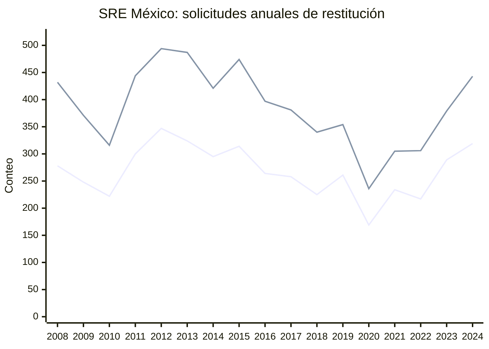
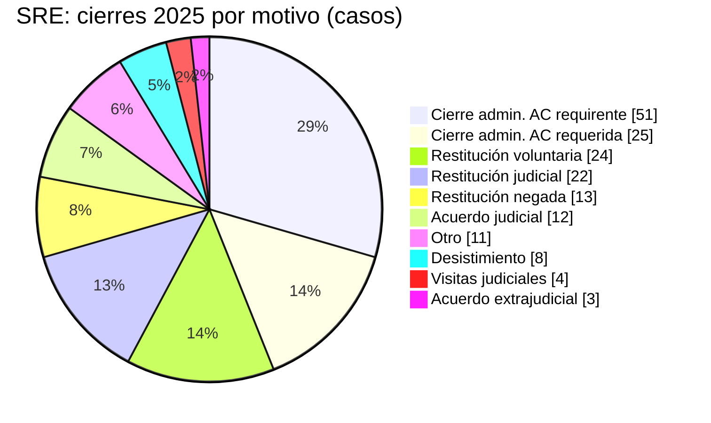
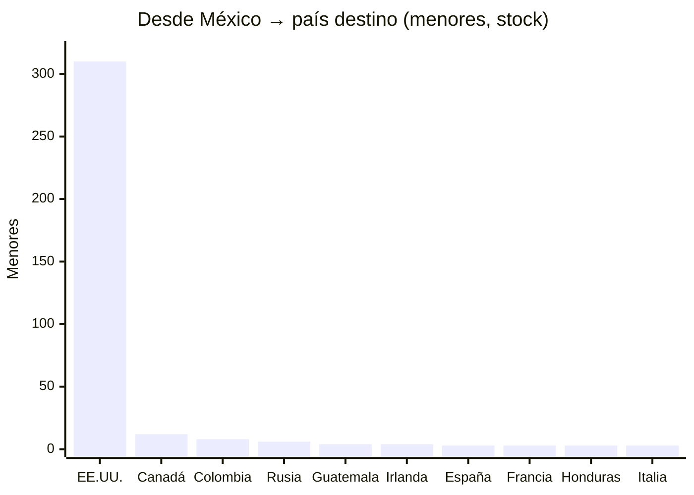
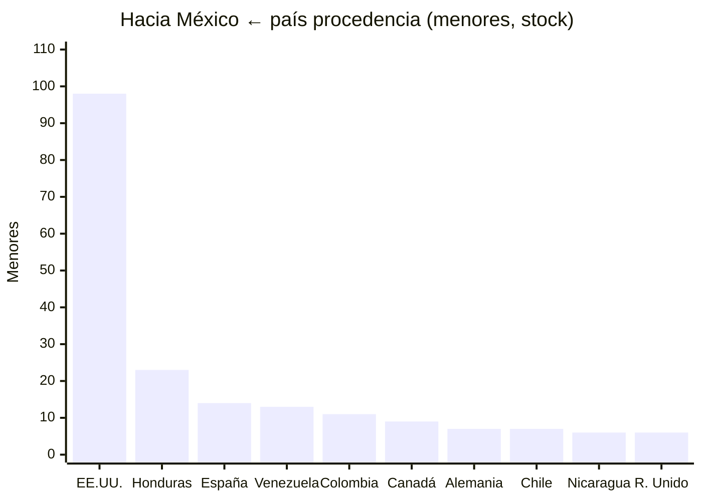
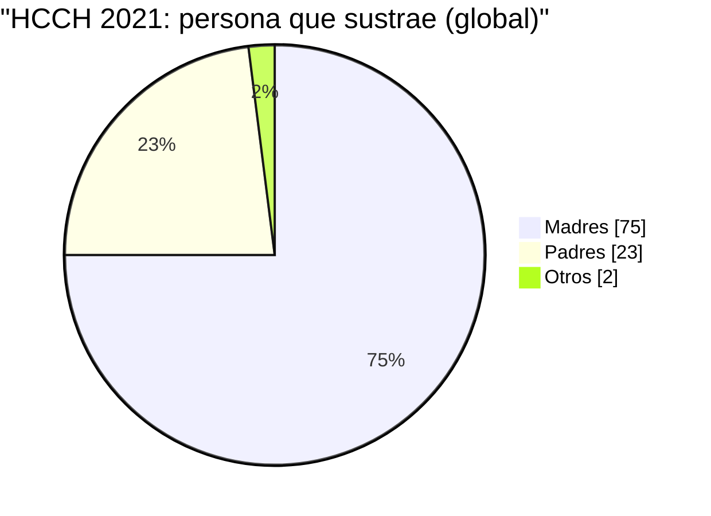
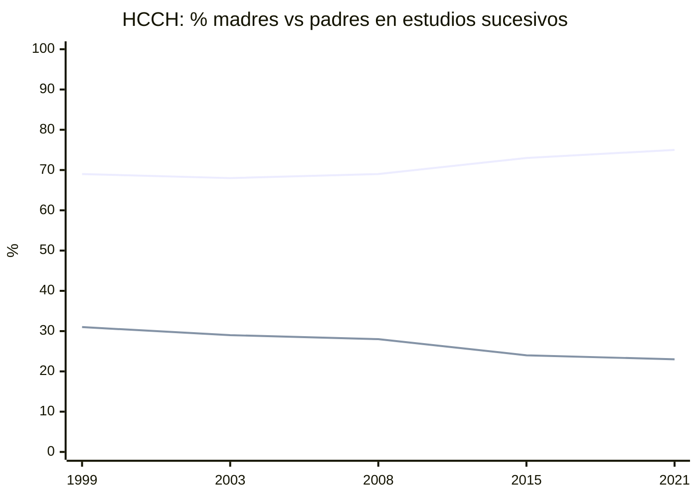
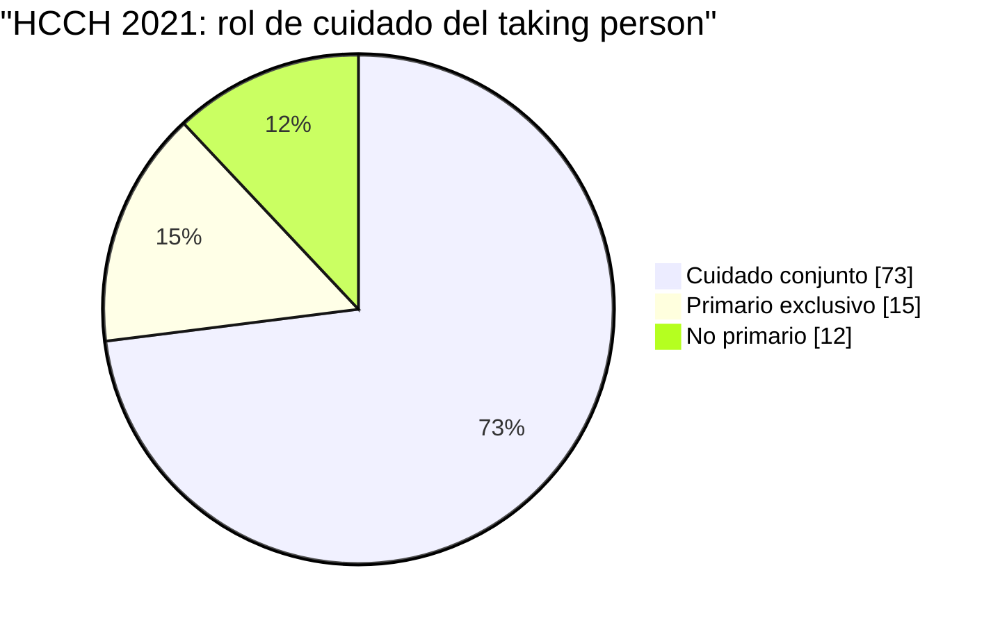
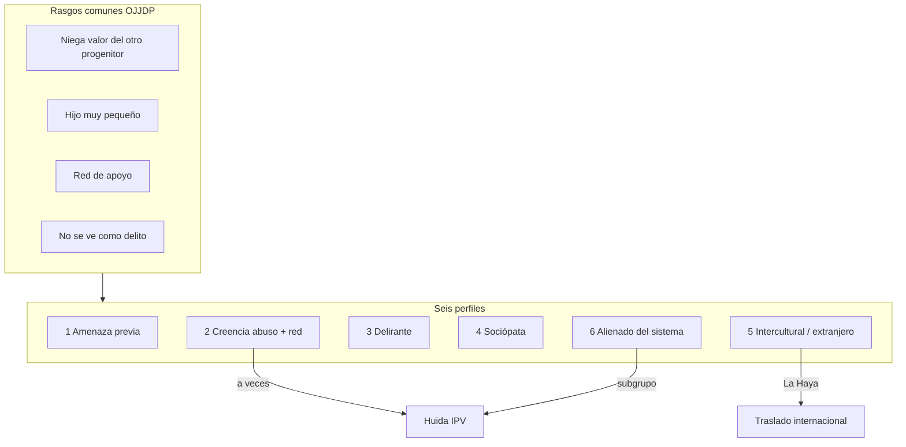
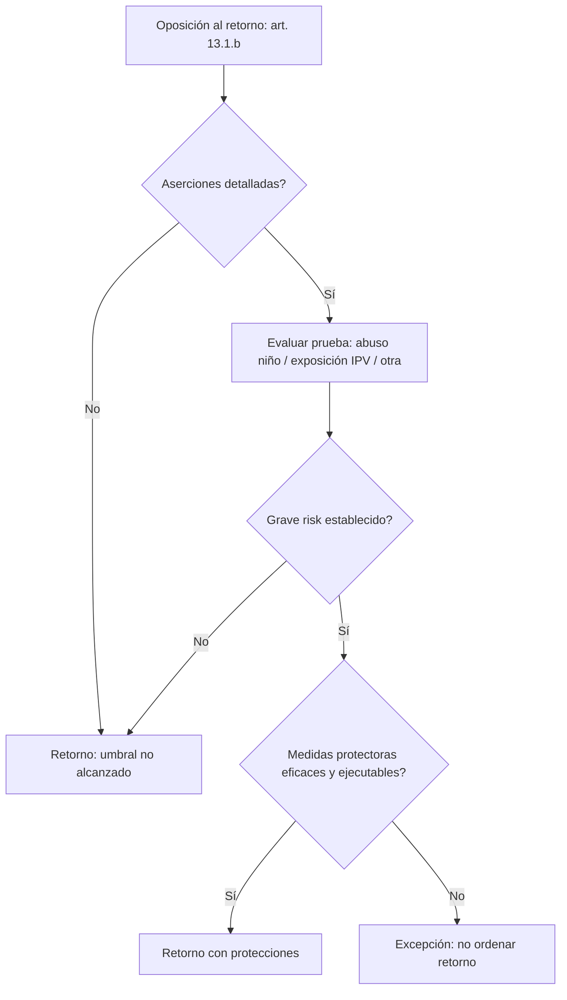

# Capítulo 4.2. Jurisprudencia mexicana (SCJN): custodia, violencia familiar e interés superior

<!-- sync:version-badge -->
> **v1.11** · conocimiento **92** · actualizado **2026-09-19**
<!-- /sync:version-badge -->

## Resumen ejecutivo

En México, el litigio de familia no opera en el vacío clínico: opera bajo criterios de la Suprema Corte de Justicia de la Nación y tesis de tribunales colegiados. Este capítulo traduce ese marco al lenguaje del Libro Vivo: interés superior, guarda y custodia, violencia familiar, prueba psicológica, convivencia con el progenitor no custodio y el deber de verificar alegaciones de alienación o manipulación parental mediante periciales. Puentes: [[Cap-04-01-Medidas-Cautelares-Sesgo|Capítulo 4.1. Medidas cautelares, presunción y victimización institucional]] · [[Cap-01-02-Redefinicion-CDN-Neurociencia|Capítulo 1.2. Redefinición operativa: Derechos del Niño y neurociencia del apego]].

## Pregunta guía

¿Qué dice la doctrina mexicana sobre custodia, violencia familiar y prueba del menor —y cómo tensiona eso con la alienación o interferencia parental?

---

## 1. Marco y definiciones

**Interés superior de la niñez:** criterio rector que obliga al juzgador a preferir la pretensión del menor cuando diverge de la de los progenitores, incluyendo el nombramiento de tutor especial ante conflicto de intereses ([@anterior2022interessuper]; [[2022-Anterior-interes-superior-del-menor-de-edad-cuando-en]]).

**Guarda y custodia de hecho vs. legal:** cuando terceros ejercen de hecho funciones parentales y el padre o madre legal busca retomar el cuidado, no aplica automáticamente el estándar de «mayor beneficio» pensado para otros escenarios ([@scjn2025guardaycustodiacua]; [[2025-Https-Sjf2-Scjn-Gob-guarda-y-custodia-cuando-terceras-personas-ej]]).

**Alienación o manipulación alegada en violencia familiar:** si la víctima es menor y se alega alienación o manipulación parental, el órgano jurisdiccional debe ordenar periciales para verificar si esa condición se actualiza ([@de2026violenciafam]; [[2026-De-violencia-familiar-cuando-la-victima-sea-una]]).

---

## 2. Evidencia documental (doctrina)

> **Nivel:** doctrina vinculante/orientadora — no es meta-análisis clínico.

### 2.1 Interés superior y conflicto de pretensiones

La tesis sobre tutor especial cuando la pretensión del menor no coincide con la de madre y padre fija un procedimiento concreto: el menor no es accesorio del litigio adulto ([@anterior2022interessuper]; [[2022-Anterior-interes-superior-del-menor-de-edad-cuando-en]]).

### 2.2 Prueba psicológica y segunda evaluación

Antes de acordar una segunda prueba psicológica al menor «para descartar alienación parental», el juzgador debe agotar procesos alternos, atento al interés superior ([@scjn2021pruebapsicolgicapr]; [[2021-Https-Sjf2-Scjn-Gob-prueba-psicologica-practicada-a-un-menor-de-e]]). Lectura del vault: la doctrina mexicana **reconoce** el problema de la alienación como objeto de prueba, y a la vez frena la cascada de evaluaciones que revictimizan.

**Cómo se traduce en peritaje estatal.** La Guía CDMX opera «interferencia parental» (no SAP) y prohíbe diagnosticar: el informe describe impacto en dinámica/expediente ([@pjcdmx2024guiatecnica]; [[2024-PJCDMX-guia-tecnica-evaluacion-intervencion-psicologica]]). El Manual Edomex estructura dictamen e interferencias alineado a la tesis de ponderación SAP ([@pjedomex2021manualfor]; [[2021-PJEdomex-manual-psicologia-forense-familiar]]; [@publico2017sindromedeal]; [[2017-Publico-sindrome-de-alienacion-parental-en-materia-fa]]). Detalle clínico-metodológico: [[Cap-03-05-Evaluacion-Custodia-Forense|Capítulo 3.5. Evaluación de custodia y peritaje forense]] §2.2c.

### 2.3 Convivencia con el progenitor no custodio

Para decretar convivencia debe analizarse que no se contraponga al interés superior de las personas menores ([@scjn2024convivenciaentrepe]; [[2024-Https-Sjf2-Scjn-Gob-convivencia-entre-personas-menores-de-edad-co]]). No hay derecho absoluto del adulto al calendario del niño.

#### 2.3b Mudanza / relocation del custodio

**México (SCJN).** Con domicilio fijado judicialmente o por convenio, el custodio **no** puede mudar al menor sin autorización del juez. Sin fijación, el cambio libre se limita si hace nugatorias o excesivamente difíciles las convivencias por distancia/costo. A distancia: régimen **combinado** (contacto físico regular + TIC) para no vaciar el vínculo ([@scjn2022mudanzadomi]; [[2022-SCJN-mudanza-domicilio-custodio-convivencia-distancia]]; tesis 1a. XXXV/2022). Distinto de sustracción La Haya (§2.6): mudanza doméstica litigada ≠ traslado ilícito internacional, aunque ambos tensionan acceso.

**Evidencia anglófona (cautela).** Braver, Ellman y Fabricius aportan evidencia empírica sobre relocation tras divorcio frente a la tendencia «lo bueno para el custodio es bueno para el niño» ([@braver2003relocatio]; [[2003-Austin-relocation-reassessment-and-redefinition-child-custody]]) —no importar como regla MX; sí como recordatorio de que mudanza = hipótesis de daño/beneficio a probar. Peritaje: [[Cap-03-05-Evaluacion-Custodia-Forense|Capítulo 3.5. Evaluación de custodia y peritaje forense]].

### 2.4 Violencia familiar y acreditación

El corpus incluye tesis sobre elementos de la violencia familiar, medidas de seguridad en favor de la víctima, y tipologías penales afines (equiparable a violencia familiar, violencia de género). Sirven como mapa de **umbrales probatorios**, no como guía clínica ([[Cap-04-03-IPV-Custodia-Denuncias|Capítulo 4.3. Violencia de pareja, custodia y denuncias: protección, instrumentalización y doble riesgo]]).

### 2.5 Amparo, emplazamiento y reconvención en familia

Otras tesis del vault cubren emplazamiento en controversias familiares ([@scjn2026emplazamientoaunac]; [[2026-Https-Sjf2-Scjn-Gob-emplazamiento-a-una-controversia-del-orden-fa]]), procedencia de reconvención en incidentes de guarda ([@scjn2026reconvencinprocede]; [[2026-Https-Sjf2-Scjn-Gob-reconvencion-procede-en-el-incidente-de-guard]]) y reglas de amparo indirecto ([@scjn2025amparoindirectopro]; [[2025-Https-Sjf2-Scjn-Gob-amparo-indirecto-procede-excepcionalmente-con]]). Son infraestructura procesal del litigio; el capítulo las indexa para operadores, sin novelar cada registro.

**Interés superior reciente.** La tesis sobre interés superior de la niñez y principio pro persona ([@httpssjf2scjn2026interessuper]; [[2026-Https-Sjf2-Scjn-Gob-interes-superior-de-la-ninez-y-principio-pro]]) complementa la línea anterior sobre tutor especial ([@anterior2022interessuper]).

### 2.6 Sustracción / restitución internacional de menores (La Haya × México)

**Fenómeno.** Traslado o retención ilícita de un menor por un progenitor (u otro) fuera del Estado de residencia habitual, en infracción del derecho de custodia/visita. El instrumento civil central es el Convenio de La Haya de 1980: restitución inmediata al *status quo* territorial —**no** reabre el fondo de custodia ([@patel2021internation]; [[2021-Patel-international-child-abduction-hague-forensic]]). Excepciones clásicas (arts. 12–13): integración tras >1 año, grave riesgo físico/psíquico o situación intolerable, oposición del menor con madurez suficiente; SCJN ha analizado esas excepciones en resúmenes argumentativos.

**Local (sí se encuentra).** México es Parte (DOF 6 mar 1992); partenariado con EE.UU. desde 1991; también Convención Interamericana. Autoridad Central: SRE ([@sre2024sustraccion]; [[2024-SRE-sustraccion-restitucion-internacional-menores-mexico]]; [gob.mx/SRE](https://www.gob.mx/sre/acciones-y-programas/sustraccion-y-restitucion-internacional-de-las-y-los-menores)). Dataset: [datos.gob.mx](https://www.datos.gob.mx/dataset/derecho_familia_restitucion_menores) · CSVs en `03-Datos/sre-restitucion/` · canvas interactivo: [SRE sustracción](/home/drds/.cursor/projects/home-drds-Documentos-Childer/canvases/sre-sustraccion-internacional.canvas.tsx).

#### Figura 1 — Solicitudes anuales SRE (casos y menores, 2008–2024)

**Lectura:** pico 2012 (347 casos / 494 menores); valle pandémico 2020 (169 / 236); recuperación 2023–2024. **Suma 2008–2024:** 4 564 solicitudes · 6 580 menores. 2025* parcial (132 / 173 al corte ~ago 2025) — omitido de la figura.

#### Tabla A — Solicitudes anuales SRE (detalle)

| Año | Casos | Menores | Año | Casos | Menores |
|-----|------:|--------:|-----|------:|--------:|
| 2008 | 278 | 432 | 2017 | 258 | 381 |
| 2009 | 248 | 371 | 2018 | 225 | 340 |
| 2010 | 222 | 316 | 2019 | 261 | 354 |
| 2011 | 300 | 444 | 2020 | 169 | 236 |
| 2012 | **347** | **494** | 2021 | 234 | 305 |
| 2013 | 324 | 487 | 2022 | 217 | 306 |
| 2014 | 295 | 421 | 2023 | 289 | 379 |
| 2015 | 314 | 474 | 2024 | 319 | 443 |
| 2016 | 264 | 397 | 2025* | 132 | 173 |

#### Figura 2 — Casos activos (stock) por dirección

```mermaid
xychart-beta
    title "SRE: casos activos (stock) — casos vs menores"
    x-axis ["Desde MX", "Hacia MX"]
    y-axis "Conteo" 0 --> 420
    bar "Casos" [291, 187]
    bar "Menores" [385, 241]
```

#### Tabla B1 — Casos activos

| Dirección / supuesto | Casos | Menores |
|----------------------|------:|--------:|
| Sustraídos **desde** México | 291 | 385 |
| Sustraídos **hacia** México | 187 | 241 |
| **Total activos** | **478** | **626** |

> Activos = inventario abierto (no sumar a la serie anual de solicitudes).

#### Figura 3 — Motivo de cierre 2025 (año parcial)

#### Tabla B2 — Motivo de cierre (2025 YTD)

| Motivo de cierre | Casos | Menores |
|------------------|------:|--------:|
| Cierre admin. AC requirente | 51 | 69 |
| Cierre admin. AC requerida | 25 | 30 |
| Restitución voluntaria | 24 | 34 |
| Restitución judicial | 22 | 33 |
| Restitución negada | 13 | 18 |
| Acuerdo judicial | 12 | 18 |
| Otro | 11 | 15 |
| Desistimiento | 8 | 13 |
| Visitas judiciales | 4 | 7 |
| Acuerdo extrajudicial | 3 | 5 |
| **Total** | **173** | **242** |

Restituciones (judicial + voluntaria) = **46/173** cierres (~27%).

#### Figura 4 — Top 10 destinos (sustraídos desde México, menores)

#### Figura 5 — Top 10 procedencias (sustraídos hacia México, menores)

#### Tabla C — Top países (menores, stock activo)

| Desde México → destino | Casos | Menores | Hacia México ← procedencia | Casos | Menores |
|------------------------|------:|--------:|----------------------------|------:|--------:|
| Estados Unidos | 232 | 310 | Estados Unidos | 73 | 98 |
| Canadá | 11 | 12 | Honduras | 19 | 23 |
| Colombia | 7 | 8 | España | 11 | 14 |
| Rusia | 3 | 6 | Venezuela | 11 | 13 |
| Guatemala | 3 | 4 | Colombia | 9 | 11 |
| Irlanda | 1 | 4 | Canadá | 6 | 9 |
| España | 3 | 3 | Alemania | 4 | 7 |
| Francia | 3 | 3 | Chile | 7 | 7 |
| Honduras | 2 | 3 | Nicaragua | 4 | 6 |
| Italia | 1 | 3 | Reino Unido | 5 | 6 |

#### Figura 6 — Sexo del progenitor que sustrae (HCCH global 2021)

**No está en datos SRE.** Los CSV públicos no desglosan madre/padre. El informe estadístico HCCH (solicitudes 2021) sí:

#### Tabla D — HCCH: *taking person* por sexo (serie)

| Estudio (año de solicitudes) | Madres | Padres | Otros |
|------------------------------|-------:|-------:|------:|
| 1999 | ~69% | — | — |
| 2003 | 68% | 29% | ~3% |
| 2008 | 69% | 28% | ~3% |
| 2015 | 73% | 24% | 2% |
| **2021** | **75%** | **23%** | **2%** |

Fuente: [@hcch2023globalreport]; [[2023-HCCH-global-report-1980-abduction-applications-2021]]. El 88% eran cuidador primario o conjunto (94% si madre; 71% si padre). **Global ≠ desglose México**; no estereotipar el expediente.

#### Perfiles de sustractores — documentos oficiales y evidencia

Hay **dos capas** que no deben confundirse: (A) **perfil estadístico** del *taking person* en La Haya (HCCH); (B) **perfiles de riesgo clínico-forenses** de interferencia parental (OJJDP / Johnston–Girdner), útiles también cuando el destino es internacional. Ninguna es diagnóstico del expediente mexicano.

##### A. Perfil estadístico HCCH (oficial, Convenio 1980)

Agregado de Autoridades Centrales ([@hcch2023globalreport]):

| Dimensión | Perfil típico 2021 |
|-----------|-------------------|
| Quién sustrae | Madre **75%** · Padre **23%** · Otros **2%** |
| Rol de cuidado | Primario solo **15%** · Conjunto **73%** · No primario **12%** → **88%** primario o conjunto |
| Si madre / si padre | Primario o conjunto: **94%** / **71%** |
| Menor | Edad media **6.7** años; **74%** un solo niño |
| «Volver a casa» | En estudios previos (no medido 2021): **~52–60%** viajaba a Estado del que era nacional |

**Implicación:** el sustractor modal La Haya **no** es el «padre no custodio que arrebata»; es con frecuencia la **madre cuidadora** (o padre cuidador conjunto) que traslada/retiene. Eso explica por qué art. 13(1)(b) y IPV (Shetty/Edleson) son nudos recurrentes —no autoriza a presuponer huida justificada ni mala fe.

##### B. Seis perfiles de riesgo OJJDP (Johnston & Girdner, 2001 — documento oficial EE.UU.)

Boletín OJJDP basado en 634 casos + comparación con litigantes de alto conflicto ([@johnston2001familyabdu]; [[2001-Johnston-Girdner-OJJDP-family-abductors-profiles]]; base empírica [@johnston1999developing]; [[1999-Johnston-profiles-risk-parental-abduction]]). **No predicen probabilidad**; guían prevención. ~50% de familias encajan en >1 perfil.

**Rasgos comunes** a la mayoría de perfiles: niegan el valor del otro progenitor para el niño; hijos muy pequeños (media 2–3 años en su muestra); red de apoyo (salvo delirante); no vivencian la conducta como delito; madres y padres con frecuencia similar pero en momentos distintos (padres más *antes* de orden; madres más *después* del decreto).

| # | Perfil | Núcleo | Nexo internacional / La Haya |
|---|--------|--------|------------------------------|
| 1 | Amenaza o sustracción previa | Historial de ocultar, retener o amenazar fuga | Indicadores de vuelo: liquidar activos, red clandestina, sin lazos locales |
| 2 | Creencia de abuso + red que refuerza | «Rescate» tras alegaciones (a veces IPV/negligencia real no investigada) | Cruza SAID/alegaciones CSA ([[Cap-04-03-IPV-Custodia-Denuncias|Capítulo 4.3. Violencia de pareja, custodia y denuncias: protección, instrumentalización y doble riesgo]]) |
| 3 | Paranoia delirante (~4%) | Fusión víctima–hijo; alto riesgo de violencia extrema | Supervisión estricta / evaluación de letalidad |
| 4 | Sociopatía grave (~4%) | Hijo como trofeo/venganza; desprecio a la autoridad | Sanciones claras; mediación confidencial inadecuada |
| 5 | Matrimonio intercultural / lazos al extranjero | «Volver a casa» tras ruptura; idealización de la cultura de origen | **Perfil La Haya clásico**; riesgo máximo si el destino **no** es Parte del Convenio |
| 6 | Alienación del sistema + apoyo en otra comunidad | Pobreza, etnicidad, IPV no protegida, nunca casados que asumen custodia exclusiva | Subgrupo IPV: víctima que huye cuando el sistema no protege |

##### C. Perfiles situacionales en literatura (no tipología única)

1. **Huida por IPV** — madre (u otro cuidador) que cruza frontera ante violencia; luego enfrenta solicitud de restitución ([@shetty2005adultdomes]; [[2005-Shetty-Edleson-domestic-violence-international-parental-abduction]]; perfil OJJDP 6). Guía POAM / art. 13(1)(b) HCCH: no tratar toda huida como «secuestro instrumental».
2. **Sustracción como control coercitivo** — padres que trasladan al extranjero para chantajear el retorno de la madre al dominio masculino ([@anon2022abductingchi]; [[2022-Anon-abducting-children-abroad-gender-power-and-tr]]).
3. **Progenitor *left behind*** — daño psíquico y litigio prolongado ([@tavares2021leftbehind]; [[2021-Tavares-left-behind-parents-parental-abduction-portugal]]).

**Regla del libro:** perfiles = **hipótesis de trabajo**, no veredicto. Combinar (A) base rates HCCH + (B) tipología OJJDP + hechos del expediente SRE/SCJN. Doble riesgo: no criminalizar de antemano a la madre cuidadora ni negar sustracción instrumental o IPV real.

**Cruce IPV.** Shetty y Edleson: IPV adulta en casos La Haya — sobrevivientes que cruzan frontera pueden enfrentar mandato de retorno ([@shetty2005adultdomes]; [[2005-Shetty-Edleson-domestic-violence-international-parental-abduction]]) —doble riesgo con [[Cap-04-03-IPV-Custodia-Denuncias|Capítulo 4.3. Violencia de pareja, custodia y denuncias: protección, instrumentalización y doble riesgo]].

##### D. Artículo 13(1)(b) — Guía HCCH Part VI (grave risk × IPV)

Texto canónico de soft law: *Guide to Good Practice* Part VI ([@hcch2020guide13b]; [[2020-HCCH-Guide-Good-Practice-Part-VI-Article-13-1-b]]). No sustituye el Convenio ni la SCJN; orienta aplicación uniforme.

| Pieza | Contenido operativo |
|-------|---------------------|
| Umbral | **Alto** y de interpretación restrictiva; tres vías: daño físico, daño psicológico, o situación intolerable |
| Prospectivo | Se evalúa el riesgo **al retornar**, no se reescribe el juicio de custodia |
| IPV | Exposición del niño a violencia doméstica del *left-behind* hacia el *taking parent* **puede** fundar grave risk (además del abuso directo al menor) |
| No basta el rótulo | Naturaleza, frecuencia, intensidad, recurrencia e **impacto**; aserciones vagas no alcanzan |
| Medidas protectoras | Disponibilidad, adecuación, eficacia y **ejecutabilidad** en el Estado de residencia habitual; cautela con *undertakings* voluntarios ante violencia grave futura |
| Paso a paso | (1) ¿las aserciones podrían constituir grave risk? → (2) ¿la prueba las establece? → (3) ¿medidas protectoras mitigan sin negar el umbral? |

**Doble riesgo (México):** (1) negar IPV documentada y ordenar retorno «automático»; (2) tratar toda huida cuidadora como inmunidad sin prueba de riesgo grave. Shetty/Edleson + Guía Part VI + perfiles OJJDP 2/6 = marco, no atajo.

### 2.7 Lectura comparada (SciELO / guarda — no sustituye SCJN)

El centro del capítulo sigue siendo **México**. Aun así, el vault aporta contraste lusófono:

- **Terminología pericial:** Brandão et al. proponen terminologia especializada para práctica pericial en Brasil ([@brandao2024terminologia]; [[2024-Brandao-terminologia-especializada-para-a-pratica-de]]) —útil para alinear lenguaje clínico y actuaciones sin importar etiquetas SAP.  
- **Guarda compartilhada:** Kostulski y Arpini documentan vivencias de hijas en guarda compartida ([@kostulski2018guardacompar]; [[2018-Kostulski-guarda-compartilhada-as-vivencias-de-filhas-a]]) y, en perspectiva paterna, la relación con el sistema judiciario ([@kostulski2025guardadefilh]; [[2025-Kostulski-guarda-de-filhos-e-o-sistema-judiciario-na-pe]]). Brito resume argumentos de jurisprudencia brasileña sobre guarda compartilhada ([@brito2013guardacompar]; [[2013-Brito-guarda-compartilhada-alguns-argumentos-e-cont]]).  
- **Peritaje en guarda:** Dantas et al. (SciELO) describen prácticas de avaliação psicológica jurídica en guarda ([@dantas2023avaliacaopsi]; [[2023-Dantas-avaliacao-psicologica-juridica-em-processos-d]]) —puente metodológico hacia [[Cap-03-05-Evaluacion-Custodia-Forense|Capítulo 3.5. Evaluación de custodia y peritaje forense]].
- **Inquirição infantil:** Brito y Parente contrastan argumentos a favor y en contra de la inquirição judicial con técnica *Depoimento sem Dano* ([@brito2012inquiricaoju]; [[2012-Brito-inquiricao-judicial-de-criancas-pontos-e-cont]]) —relevante cuando la SCJN ordena prueba psicológica sin revictimizar ([@scjn2021pruebapsicolgicapr]; [[2021-Https-Sjf2-Scjn-Gob-prueba-psicologica-practicada-a-un-menor-de-e]]).
- **Factores familiares y conducta escolar:** Rodríguez (Medellín) asocia inconsistencia en pautas de crianza y no vivir con el núcleo familiar con problemas de conducta externalizante ([@rodriguez2010factorespers]; [[2010-Rodriguez-factores-personales-y-familiares-asociados-a]]) —contexto clínico al ponderar convivencia ([@scjn2024convivenciaentrepe]; [[2024-Https-Sjf2-Scjn-Gob-convivencia-entre-personas-menores-de-edad-co]]).
- **Escalas de percepción parental (SciELO):** Casullo y Liporace miden control e inconsistencia parental en adolescentes ([@casullo2008percepcionso]; [[2008-Casullo-percepcion-sobre-estilos-e-inconsistencia-par]]); Cerqueira y Nascimento validan LOCPS —locus de control parental en salud ([@cerqueira2008construcaoev]; [[2008-Cerqueira-construcao-e-validacao-da-escala-de-locus-de]]) —covariables de **control percibido**, no etiqueta SAP ([[Cap-02-02-Evaluacion-Medicion-PABs|Capítulo 2.2. Evaluación y medición: comportamientos parentales alienantes, escalas y peritaje]]).

### 2.8 Límites

- Tesis aisladas ≠ criterio único nacional; verificar época, órgano y vigencia.  
- Doctrina no valida ni invalida por sí sola el constructo clínico de alienación.  
- Remitirse al texto íntegro en `_raw/` / Semanario antes de citar en litigio.
- Sustracción internacional: cifras SRE/US State ≠ tasa de «secuestro» en divorcios domésticos; distinguir civil (La Haya), penal y alegación falsa.

---

## 3. Falla institucional / sesgo ideológico

Dos lecturas sesgadas de la misma doctrina: (1) «toda alegación de alienación exige perito» como arma dilatoria; (2) «la alienación no existe» ignorando tesis que mandan verificarla. El interés superior exige **prueba situacional**, no eslogan ([[Cap-05-01-Asimetrias-Denuncia-Dogma|Capítulo 5.1. Asimetrías punitivas, denuncia instrumental y dogma de política pública]]).

---

## 4. Impacto en el menor

Cada evaluación acumulada, cada convivencia insegura y cada tutela omitida son tiempo de apego o de miedo. La doctrina mexicana, leída bien, pone al menor en el centro; leída mal, lo convierte en expediente ([[Cap-02-01-Trauma-Ruptura-Vinculo|Capítulo 2.1. Trauma de ruptura forzada: apego, estrés y neurodesarrollo]]).

---

## 5. Laboratorio literario

El Semanario escribe en mayúsculas lo que la casa susurra. La letra de la tesis puede ser escudo o *damnatio*. Ampliar en [[Cap-06-01-Medea-Damnatio-Rehen|Capítulo 6.1. Laboratorio literario: Medea, damnatio memoriae y el menor como rehén]].

---

## 6. Síntesis operativa

1. Mapear tesis vigentes de interés superior, convivencia y violencia familiar al caso concreto.  
2. Si se alega alienación/manipulación en perjuicio del menor: periciales —sin cascada innecesaria.  
3. Separar doctrina mexicana de evidencia clínica internacional ([[Cap-02-02-Evaluacion-Medicion-PABs|Capítulo 2.2. Evaluación y medición: comportamientos parentales alienantes, escalas y peritaje]]).  
4. Cruzar con cautelares ([[Cap-04-01-Medidas-Cautelares-Sesgo|Capítulo 4.1. Medidas cautelares, presunción y victimización institucional]]) y violencia de pareja ([[Cap-04-03-IPV-Custodia-Denuncias|Capítulo 4.3. Violencia de pareja, custodia y denuncias: protección, instrumentalización y doble riesgo]]).

## Oleada de evidencia (2026-09-19)

| Citekey | Stem | Nivel | Score |
|---------|------|-------|-------|
| [@anterior2022interessuper] | [[2022-Anterior-interes-superior-del-menor-de-edad-cuando-en]] | media | 70 |
| [@scjn2025guardaycustodiacua] | [[2025-Https-Sjf2-Scjn-Gob-guarda-y-custodia-cuando-terceras-personas-ej]] | media | 70 |
| [@httpssjf2scjn2025principioded] | [[2025-Https-Sjf2-Scjn-Gob-principio-de-definitividad-en-amparo-directo-2]] | media | 60 |
| [@httpssjf2scjn2026excepcionalp] | [[2026-Https-Sjf2-Scjn-Gob-excepcion-al-principio-de-definitividad-en-am]] | media | 60 |
| [@scjn2026emplazamientoaunac] | [[2026-Https-Sjf2-Scjn-Gob-emplazamiento-a-una-controversia-del-orden-fa]] | media | 60 |
| [@scjn2026reconvencinprocede] | [[2026-Https-Sjf2-Scjn-Gob-reconvencion-procede-en-el-incidente-de-guard]] | media | 60 |
| [@scjn2025emplazamientoaunac] | [[2025-Https-Sjf2-Scjn-Gob-emplazamiento-a-una-controversia-del-orden-fa]] | media | 60 |
| [@httpssjf2scjn2025suspensionpr] | [[2025-Https-Sjf2-Scjn-Gob-suspension-provisional-contra-el-cambio-de-ad-2]] | media | 60 |
| [@scjn2021pruebapsicolgicapr] | [[2021-Https-Sjf2-Scjn-Gob-prueba-psicologica-practicada-a-un-menor-de-e]] | media | 60 |
| [@httpssjf2scjn2026regimendecon] | [[2026-Https-Sjf2-Scjn-Gob-regimen-de-convivencias-la-accion-para-modifi]] | media | 60 |
| [@scjn2025amparoindirectopro] | [[2025-Https-Sjf2-Scjn-Gob-amparo-indirecto-procede-excepcionalmente-con]] | media | 60 |
| [@httpssjf2scjn2025principioded] | [[2025-Https-Sjf2-Scjn-Gob-principio-de-definitividad-en-amparo-directo]] | media | 60 |
| [@httpssjf2scjn2026excepcionalp] | [[2026-Https-Sjf2-Scjn-Gob-excepcion-al-principio-de-definitividad-en-am-2]] | media | 60 |
| [@seguimiento2025amparoindire] | [[2025-Seguimiento-amparo-indirecto-por-regla-general-procede-co]] | media | 60 |
| [@ninas2026cosajuzgadae] | [[2026-Ninas-cosa-juzgada-en-el-juicio-de-amparo-cuando-se]] | media | 60 |
| [@httpssjf2scjn2025juiciosumari] | [[2025-Https-Sjf2-Scjn-Gob-juicio-sumario-civil-cuando-se-promueve-para]] | media | 60 |
| [@scjn2017delitodeviolacinag] | [[2017-Https-Sjf2-Scjn-Gob-delito-de-violacion-agravada-por-haberse-come]] | media | 60 |
| [@scjn2022violenciafamiliarp] | [[2022-Https-Sjf2-Scjn-Gob-violencia-familiar-para-acreditar-los-element]] | media | 60 |
| [@scjn2024pensinalimenticiae] | [[2024-Https-Sjf2-Scjn-Gob-pension-alimenticia-el-progenitor-no-custodio]] | media | 60 |
| [@httpssjf2scjn2025suspensionpr] | [[2025-Https-Sjf2-Scjn-Gob-suspension-provisional-contra-el-cambio-de-ad]] | media | 60 |
| [@scjn2024cosajuzgadamateria] | [[2024-Https-Sjf2-Scjn-Gob-cosa-juzgada-material-o-refleja-no-se-actuali]] | media | 60 |
| [@scjn2024convivenciaentrepe] | [[2024-Https-Sjf2-Scjn-Gob-convivencia-entre-personas-menores-de-edad-co]] | media | 60 |
| [@httpssjf2scjn2026suplenciadel] | [[2026-Https-Sjf2-Scjn-Gob-suplencia-de-la-queja-deficiente-en-materia-p]] | media | 35 |
| [@httpssjf2scjn2025recursodeape] | [[2025-Https-Sjf2-Scjn-Gob-recurso-de-apelacion-es-procedente-contra-la]] | media | 35 |
| [@httpssjf2scjn2025conveniodedi] | [[2025-Https-Sjf2-Scjn-Gob-convenio-de-divorcio-requisitos-que-debe-colm]] | media | 35 |

## Fuentes integradas

- [@anterior2022interessuper] · [[2022-Anterior-interes-superior-del-menor-de-edad-cuando-en]]
- [@scjn2025guardaycustodiacua] · [[2025-Https-Sjf2-Scjn-Gob-guarda-y-custodia-cuando-terceras-personas-ej]]
- [@scjn2026emplazamientoaunac] · [[2026-Https-Sjf2-Scjn-Gob-emplazamiento-a-una-controversia-del-orden-fa]]
- [@o2025suspensionco] · [[2025-O-suspension-condicional-del-proceso-estandar-p]]
- [@scjn2026reconvencinprocede] · [[2026-Https-Sjf2-Scjn-Gob-reconvencion-procede-en-el-incidente-de-guard]]
- [@scjn2025emplazamientoaunac] · [[2025-Https-Sjf2-Scjn-Gob-emplazamiento-a-una-controversia-del-orden-fa]]
- [@scjn2021pruebapsicolgicapr] · [[2021-Https-Sjf2-Scjn-Gob-prueba-psicologica-practicada-a-un-menor-de-e]]
- [@scjn2025amparoindirectopro] · [[2025-Https-Sjf2-Scjn-Gob-amparo-indirecto-procede-excepcionalmente-con]]
- [@seguimiento2025amparoindire] · [[2025-Seguimiento-amparo-indirecto-por-regla-general-procede-co]]
- [@ninas2026cosajuzgadae] · [[2026-Ninas-cosa-juzgada-en-el-juicio-de-amparo-cuando-se]]
- [@scjn2017delitodeviolacinag] · [[2017-Https-Sjf2-Scjn-Gob-delito-de-violacion-agravada-por-haberse-come]]
- [@scjn2022violenciafamiliarp] · [[2022-Https-Sjf2-Scjn-Gob-violencia-familiar-para-acreditar-los-element]]
- [@scjn2024pensinalimenticiae] · [[2024-Https-Sjf2-Scjn-Gob-pension-alimenticia-el-progenitor-no-custodio]]
- [@scjn2024cosajuzgadamateria] · [[2024-Https-Sjf2-Scjn-Gob-cosa-juzgada-material-o-refleja-no-se-actuali]]
- [@scjn2024convivenciaentrepe] · [[2024-Https-Sjf2-Scjn-Gob-convivencia-entre-personas-menores-de-edad-co]]

## Enlaces relacionados

- [[ficha-tecnica-obra]]
- [[MOC-Evidencia]]
- [[tpl-capitulo-nota]]

<!-- sync:mermaid-boot -->

<!-- /sync:mermaid-boot -->
