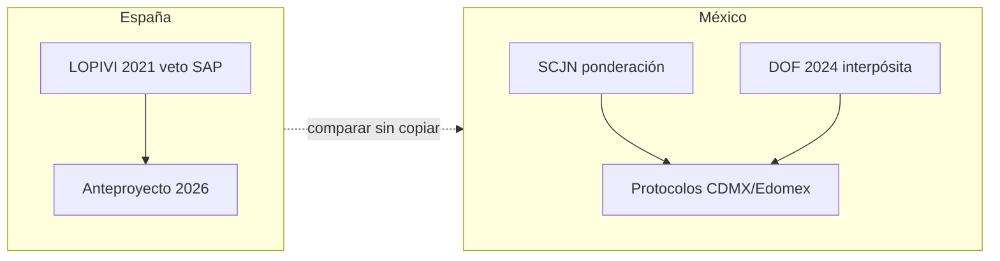
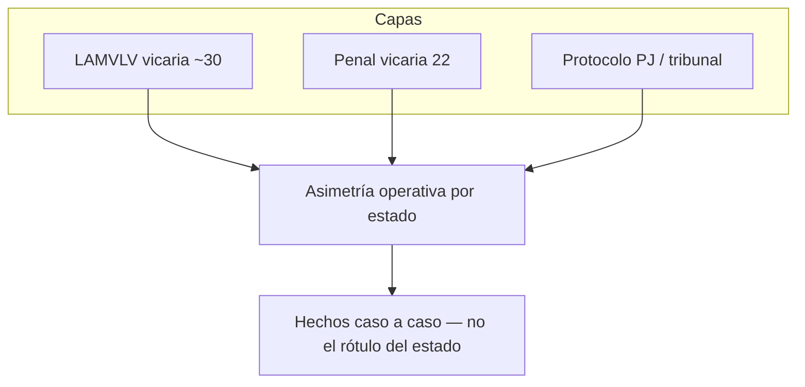

# Capítulo 5.1. Asimetrías punitivas, denuncia instrumental y dogma de política pública

<!-- sync:version-badge -->
> **v1.11** · conocimiento **123** · actualizado **2026-09-20**
<!-- /sync:version-badge -->

## Resumen ejecutivo

La ciencia mide conductas y daños; la política decide **qué daños cuentan**. Este capítulo analiza asimetrías: sistemas que maximizan la primera denuncia, vetos al SAP que pueden obturar la interferencia, y campañas científicas que sustituyen réplica por retractación. No niega la violencia de género ni la convierte en único guion. Hilo: [[Cap-04-01-Medidas-Cautelares-Sesgo|Capítulo 4.1. Medidas cautelares, presunción y victimización institucional]] · [[Cap-01-01-Genealogia-SAP-Interferencia-Vicaria|Capítulo 1.1. Genealogía crítica: Del SAP (Gardner) a la Interferencia Parental y la Violencia Vicaria]].

## Pregunta guía

¿Qué incentivos crea el derecho —y el discurso público— para instrumentalizar al menor o para negar esa instrumentalización?

---

## 1. Marco y definiciones

**Asimetría punitiva:** diseño normativo donde una alegación activa consecuencias graves y rápidas, mientras la defensa o la hipótesis alternativa enfrenta umbrales mucho más altos.

**Denuncia instrumental:** uso del aparato penal/protector para obtener ventaja en custodia o para ejecutar borrado del otro progenitor —sin negar que la mayoría de denuncias puedan ser verdaderas en otros contextos.

**Dogma de política pública:** afirmación tratada como axioma («el SAP nunca», «la alienación siempre») inmune a evidencia caso a caso.

---

## 2. Evidencia científica / documental

> **Nivel:** controversia (posiciones institucionales, sysrev, cualitativo de supervivientes, psicometría de agresión legal).

### 2.1 Mapas normativos y «exportación» del constructo

Weidenslaufer et al. (BCN) contrastan críticas ONU/CEDAW/OMS/APA al SAP con legislaciones que procesan o prohíben alienación; España 2021 vs. Brasil/Puerto Rico vs. rechazo chileno del boletín SAP-VIF ([@weidenslaufer2023bcn]; [[2023-Weidenslaufer-Lampert-Truffello-AP-Chile-derecho-comparado]]). Leonetti advierte sobre la «exportación» estadounidense del SAP como producto jurídico peligroso ([@leonetti2023combattingad]; [[2023-Leonetti-combatting-a-dangerous-american-export-the-ne]]). Segura (Chile) sitúa el SAP como forma de maltrato ([@segura2006elsindromede]; [[2006-Segura-el-sindrome-de-alienacion-parental-una-forma]]). Portilla-Saavedra revisa perspectivas y tendencias del concepto ([@portillasaavedr2021perspectivas]; [[2021-Portilla-Saavedra-perspectivas-y-tendencias-actuales-del-concep]]).

#### 2.1b Mapa MX–ES actualizado (PAS/AP / vicaria / peritaje)

| Jurisdicción                  | Norma clave                                                                                                                                 | Qué hace                                                                                                                                                                                                      | Qué no hace                                                                                                                    |
| ----------------------------- | ------------------------------------------------------------------------------------------------------------------------------------------- | ------------------------------------------------------------------------------------------------------------------------------------------------------------------------------------------------------------- | ------------------------------------------------------------------------------------------------------------------------------ |
| **España**                    | LOPIVI art. 11.3 / 26.3 ([@boe2021lopivi]; [[2021-BOE-LOPIVI-Ley-Organica-8-2021-infancia-violencia]])                                      | Impide tomar en consideración el SAP u otros criterios «sin aval científico» que presuman manipulación adulta; parentalidad positiva ≠ imponer custodia compartida ni SAP                                     | No tipifica «interferencia» como delito; no niega hechos de denigración/sabotaje si se prueban sin el síndrome                 |
| **España (tramitación)**      | Anteproyecto reforma LOPIVI (may 2026) + informe CGPJ ([@espana2026anteproyect]; [[2026-Espana-Anteproyecto-reforma-LOPIVI-SAP-CGPJ]])      | Propuesta: prohibición **expresa** SAP/reformulaciones; informes basados en SAP inutilizables; resoluciones impugnables; escucha del menor sin umbral 12 años                                                 | **No es BOE** aún. CGPJ: insuficiencia de medios; sugiere excluir *valor probatorio* más que prohibir introducción del informe |
| **México federal**            | DOF 17-ene-2024 — violencia por **interpósita persona** ([@dof2024interpósita]; [[2024-DOF-violencia-interpósita-persona-LGAMVLV-CCF-CPF]]) | Define conductas (amenazas, ocultamiento/sustracción, usar hijos para info, fomentar violencia contra la madre, litigación con hechos falsos, condicionar alimentos); limita patria potestad; agravante penal | Nombre legal ≠ «alienación»; no homologa tipificación estatal; riesgo de usar el rótulo como atajo                             |
| **México (SCJN)**             | Tesis ponderación SAP ([@publico2017sindromedeal]; [[2017-Publico-sindrome-de-alienacion-parental-en-materia-fa]])                          | Tratamiento judicial con interés superior + equidad de género; no aplicación mecánica                                                                                                                         | No es veto absoluto ni validación del síndrome                                                                                 |
| **México estatal (mapa BCN)** | Aguascalientes / Oaxaca (prohibiciones citadas en BCN 2023)                                                                                 | Prohibiciones locales del constructo SAP/AP según BCN                                                                                                                                                         | Heterogeneidad federal; verificar vigencia local antes de citar en litigio                                                     |
| **México (peritaje)**         | Guía CDMX + Manual Edomex                                                                                                                   | Operan **interferencia parental** con método; evaluación ≠ diagnóstico                                                                                                                                        | No sustituyen ley federal; no son AFCC                                                                                         |

**Lectura dual del libro:** (1) España veta el *encapsulado sindrómico*; México federal tipifica un haz de **conductas** bajo violencia de género (interpósita) y la SCJN exige ponderación. (2) Ningún polo autoriza a silenciar IPV ni a convertir todo rechazo en «manipulación». COP Madrid aporta estándar profesional de informe completo ([@copmadrid2009guiabuenas]). Detalle forense: [[Cap-03-05-Evaluacion-Custodia-Forense|Capítulo 3.5. Evaluación de custodia y peritaje forense]] §2.2c · cautelares: [[Cap-04-01-Medidas-Cautelares-Sesgo|Capítulo 4.1. Medidas cautelares, presunción y victimización institucional]].

#### 2.1c Protocolos estatales VG / vicaria — asimetría por entidad

([@vf2026mapavgestatal]; [[2026-VF-mapa-protocolos-vg-vicaria-AP-por-estado]]; CSV `03-Datos/protocolos-vg-estatales/`)

**Premisa:** no existe un protocolo nacional único de «violencia de género × custodia». La asimetría operativa es **federalismo desigual** en tres capas independientes:

| Capa | Conteos (~2025) | Efecto |
|------|-----------------|--------|
| LAMVLV reconoce vicaria | ~29–30 entidades | Discurso / obligaciones administrativas |
| Tipificación **penal** vicaria | **22** (lista Infobae ene-2025) | Denuncia + cautelares con diente |
| Protocolo PJ localizado (VG/vicaria/PG) | Pocas entidades con texto público | Opera el expediente día a día |

**Tipología de asimetría (Meland dual):**

| Tipo | Ejemplos | Riesgo |
|------|----------|--------|
| **V+ / AP−** | Jalisco (protocolo judicial **vicaria** ~2024; narrativa AP = herramienta del agresor) | Protege IPV real; puede obturar PABs si se presume «siempre es vicaria» |
| **V+ / AP+** | **Michoacán** — protocolo VG 2019/21 ([@pjmich2021protocolovg]; [[2021-PJMich-protocolo-actuacion-judicial-violencia-genero]]) **y** AP como violencia familiar en CP local | Choque de rótulos en el mismo caso |
| **V+ / PG genérico** | CDMX — Protocolo juzgar con enfoque de género 2022 (no dedicado a vicaria) | Perspectiva de género sin tipicidad automática |
| **Esp. institucional** | Chihuahua — Tribunal Mixto Especializado VG (penal+familiar) | Menos fragmentación; no equivale a tipificación penal de vicaria |
| **V− (sin tipificación en lista)** | Edomex, NL, Gto, Ver, Tab, … | Pueden tener LAMVLV o peritaje (Tabasco) sin diente penal vicaria |
| **Federal** | DOF interpósita 2024 + SCJN Protocolo PG 2022 | Conductas vía hijos con guion de género; **no** homologa tipificación estatal |

**Penal tipificada (22):** AGS, BC, BCS, Campeche, Coahuila, CDMX, Chiapas, Guerrero, Hidalgo, Jalisco, Michoacán, Morelos, Nayarit, Oaxaca, Puebla, Quintana Roo, Sinaloa, Sonora, Tamaulipas, Tlaxcala, Yucatán, Zacatecas.

**Lectura Cap-05:** la primera denuncia de «vicaria» en un estado V+ activa aparato distinto al de un estado V−; en Michoacán, además, la contraparte puede invocar AP tipificada. Eso **no** prueba tasas de IPV ni de PABs —prueba **incentivos procesales desiguales**. Verificación de vigencia = obligación antes de citar en litigio (listas cambian; oct-2025 reportó ~24 tipificaciones).

**Puentes:** FNVV advocacy ≠ epi ([[Cap-01-03]] §2.4e) · cautelares ([[Cap-04-01]]) · peritaje CDMX/Edomex/Tabasco ([[Cap-03-05]] §2.2c).

### 2.2 Evidencia, sysrev y perícia

Lee-Maturana et al.: revisión sistemática sobre alienación parental ([@leematurana2021alienacionpa]; [[2021-Lee-Maturana-alienacion-parental-una-revision-sistematica]]). Kirchesch aborda evaluación psicológica forense de AP ([@kirchesch2023avaliacaopsi]; [[2023-Kirchesch-avaliacao-psicologica-forense-da-alienacao-pa]]). Hine: prevalencia de PABs y malestar ([@hine2026pab]; [[2026-Hine-Harman-PAB-prevalence-UK-young-adults]]). Head: campañas de retractación y supresión de crítica ([@head2026retraction]; [[2026-Head-retraction-suppression-PA-scholarship]]) —**dogma vs. réplica**.

### 2.2a Tribunal, gradiente de tácticas y progenitor objetivo

Faller (1998) describe el SAP, métodos de documentación y su uso en alegaciones de abuso en divorcio ([@faller1998theparentala]; [[1998-Faller-the-parental-alienation-syndrome-what-is-it-a]]) —referencia **histórica** del constructo en tribunal, no validación sindrómica ([[Cap-01-01-Genealogia-SAP-Interferencia-Vicaria|Capítulo 1.1. Genealogía crítica: Del SAP (Gardner) a la Interferencia Parental y la Violencia Vicaria]]). Bala et al. revisan sentencias canadienses 1989–2008 donde la alienación aparece como categoría procesal ([@bala2010parentalalie]; [[2010-Bala-parental-alienation-canadian-court-cases-1989]]). López et al. analizan un gradiente de estrategias según custodia y sexo del custodio ([@lopez2014parentalalie]; [[2014-Lopez-parental-alienation-gradient-strategies-for-a]]) —asimetría **conductual** que converge con el doble filo Meland, no con monopolio de un género. Balmer et al. (encuesta) y Poustie et al. (análisis temático) documentan severidad de tácticas, distancia del hijo y costos emocionales/financieros al interactuar con sistemas legales y de protección ([@balmer2017parentalalie]; [[2017-Balmer-parental-alienation-targeted-parent-perspecti]] · [@poustie2018theforgotten]; [[2018-Poustie-the-forgotten-parent-the-targeted-parent-pers]]) —lectura crítica de cómo el aparato **amplifica o ignora** al progenitor excluido. Brito sistematiza el debate sobre inquirição judicial infantil (*Depoimento sem Dano*) en Brasil ([@brito2012inquiricaoju]; [[2012-Brito-inquiricao-judicial-de-criancas-pontos-e-cont]]): política de testimonio sin daño, no prueba de prevalencia de PA. Barreto et al. (SciELO) describen reequilibrio familiar bajo crisis extrema ([@barreto2023encontrarunn]; [[2023-Barreto-encontrar-un-nuevo-equilibrio-estudio-cualita]]) —analogía cautelosa al movimiento sistémico post-separación.

### 2.3 Doble filo: Meland y análisis género–DV

Meland (*conditioned love*): PA no es exclusiva de un género; coexistencia con otras violencias; alegaciones falsas posibles; IPV real no negable ([@meland2026love]; [[2026-Meland-parental-alienation-conditioned-love]]). Experiencia válida de PA sin cerrar nosología ([@meland2023parentalalie]; [[2023-Meland-parental-alienation-a-valid-experience]]). Berg analiza PA en contexto de violencia doméstica y género ([@berg2011parentalalie]; [[2011-Berg-parental-alienation-analysis-domestic-violenc]]).

### 2.4 IPV, custodia y contabilidad de la violencia

Jaffe et al. sobre disputas de custodia con alegaciones de violencia doméstica ([@jaffe2008custodydispu]; [[2008-Jaffe-custody-disputes-involving-allegations-of-dom]]). Stark: contabilizar adecuadamente la IPV en política y práctica ([@stark2019properlyacco]; [[2019-Stark-properly-accounting-for-domestic-violence-in]]). Gennari: modelo clínico IPV–custodia ([@gennari2018intimatepart]; [[2018-Gennari-intimate-partner-violence-and-child-custody-e]]). Cardeal et al.: revisión sistemática de tecnologías patriarcales ([@cardeal2025tecnologiasp]; [[2025-Cardeal-tecnologias-patriarcais-uma-revisao-sistemati]]) —coerción digital como asimetría moderna.

### 2.5 Supervivientes, family court y victimización secundaria

Bradshaw et al.: perspectivas de supervivientes de IPV ([@bradshaw2023intimatepart]; [[2023-Bradshaw-intimate-partner-violence-survivors-perspecti]]). Archer-Kuhn: «¿Quién nos va a proteger?» —supervivientes domésticas ([@archerkuhn2022whosgoingtok]; [[2022-Archer-Kuhn-who-s-going-to-keep-us-safe-surviving-domesti]]). Kuruppu et al.: experiencia cualitativa devastadora en family court australiano ([@kuruppu2023familycourts]; [[2023-Kuruppu-family-court-sucks-out-your-soul-australian-g]]). Victimización secundaria al navegar derecho de familia: silenciamiento, control, presión a acuerdos inseguros, acusaciones de PA ([@anon2017secondaryvic]; [[2017-Anon-secondary-victimization-domestic-violence-sur]]). Spearman: precariedad protectiva post-separación ([@spearman2025navigatingpr]; [[2025-Spearman-navigating-protective-precarity-a-thematic-an]]; [@spearman2023firearmsandp]; [[2023-Spearman-firearms-and-post-separation-abuse-providing]]).

### 2.6 Instrumentalización, denuncias falsas en divorcio y agresión legal-administrativa

**Definición operativa.** Denuncia/alegación instrumental: activar el aparato penal, protector o cautelar para ventaja en custodia o para *damnatio* del otro progenitor —**sin** negar que muchas denuncias son fundadas.

**SAID syndrome vs. tipologías empíricas.** El *Sexual Allegations in Divorce* (SAID) Syndrome de Blush & Ross (1987) —y discriminadores de 1990— es un marco clínico de tipologías en alegaciones CSA×divorcio, **no** un diagnóstico DSM/CIE ni una tasa ([@blush1987sexualalleg]; [[1987-Blush-Ross-sexual-allegations-in-divorce-said-syndrome]]; [@ross1990sexualabuse]; [[1990-Ross-Blush-sexual-abuse-validity-discriminators-divorce]]). Crítica APSAC/Faller: opinión sin datos + sesgo maternal. Faller & DeVoe (1996, N=215) muestran clases múltiples (abuso→divorcio; revelación post-divorcio; abuso post-ruptura; falsas adultas/infantiles; etc.); substanciación clínica ~73% ([@faller1996allegations]; [[1996-Faller-DeVoe-allegations-of-sexual-abuse-in-divorce]]; Faller 1991: [@anon1991possibleexpl]). Fegert registra el nombre SAID en el debate de polarización ([@anon1995childpsychia]). Política del libro: historiar el SAID como **dogma gemelo** del PAS (atajo sindrómico), no como evidencia de prevalencia.

**Evidencia en contexto de divorcio/custodia.** Smit et al.: revisión CSA en divorcio; respuesta judicial (pericia + suspensión temporal de contacto); estimación cautelosa ~1/7–8 infundadas; literatura escasa ([@smit2015betweenscyll]; [[2015-Smit-between-scylla-and-charybdis-csa-allegations-divorce]]). Base rates de alegaciones falsas de abuso sexual: crítica metodológica ([@anon2018thefrequency]; [[2018-Anon-the-frequency-of-false-allegations-of-child-s]]). Meier: mapeo empírico género×alegaciones falsas en custodia ([@meier2017mappinggende]; [[2017-Meier-mapping-gender-shedding-empirical-light-on-fa]]). Clásicos: verdaderas/falsas en custodia ([@anon1986trueandfalse]; [[1986-Anon-true-and-false-allegations-of-sexual-abuse-in]]); «mendacious moms / devious dads» ([@anon1995mendaciousmo]; [[1995-Anon-mendacious-moms-or-devious-dads-some-perplexi]]); Corwin en custodia ([@corwin1987childsexuala]; [[1987-Corwin-child-sexual-abuse-and-custody-disputes-no-ea]]); Kaplan 1981 ([@kaplan1981childsacus]); Derdeyn et al. sobre evaluación adecuada ([@derdeyn1994adequateeva]).

**Comparados contemporáneos.** Divorcio de alto conflicto NL (Montfoort; Ruiter mitos vs. datos) ([@montfoort2018beschuldigin]; [@ruiter2017mythenoverco]; [@ruiter2018onderzoeknaa]; [[2018-Ruiter-onderzoek-naar-conflictscheidingen-een-reacti]]). Family courts India: misuso de alegaciones de crueldad/IPV ([@gulyani2025legalsafegua]; [[2025-Gulyani-legal-safeguard-or-legal-misuse-a-study-on-th]]); daño psicosocial de alegaciones falsas ([@bharti2025psychosocial]; [[2025-Bharti-psychosocial-and-legal-consequences-of-false]]); demandados ante alegaciones en custodia/DV ([@roy2025justiceforal]; [[2025-Roy-justice-for-all-exploring-legal-equality-and]]). Padres no residentes AU y dinámicas adversariales ([@violi2024australianno]; [[2024-Violi-australian-non-resident-fathers-relationship]]).

**Aparato y sesgos cognitivos.** Agresión legal-administrativa ([@anon2015aselfreportm]; [[2015-Anon-a-self-report-measure-of-legal-and-administra]]). Miedo a falsas alegaciones en jurados ([@anon2021jurorsgender]; [[2021-Anon-jurors-gender-and-their-fear-of-false-child-s]]). Self-affirmation y denuncias ([@anon2022selfaffirmat]; [[2022-Anon-self-affirmation-and-false-allegations-the-ef]]). Coaching infantil ([@lyon2008coachingtrut]; [[2008-Lyon-coaching-truth-induction-and-young-maltreated]]). Error forense Outreau ([@anon2011forensicpsyc]; [[2011-Anon-forensic-psychiatry-in-france-the-outreau-cas]]). Death & Ferguson: «alienación/coaching» usado en AU para rebatir alegaciones CSA —asimetría procesal a vigilar ([@death2019parentalalie]; [[2019-Death-Ferguson-parental-alienation-coaching-best-interests]]).

**México — IPV sí, PABs aún no.** ENDIREH 2021: 70,1% / 42,8%; pareja psicológica 35,4% / 18,4%; denuncia pareja 27,7% ([@inegi2021endireh]). **No** hay prevalencia nacional de PABs; hoja de ruta en [[Cap-01-03-Estadistica-Mapa-Evidencia|Capítulo 1.3. Mapa estadístico: prevalencia, base rates y límites de la evidencia]] §2.4b (encuesta tipo Hine / módulo ENDIREH / no inventar %). ENDIREH 2026 propone vicaria ([@inegi2025endireh26]).

**Política.** Castigar fraude procesal **sin** presumir fraude; proteger IPV **sin** inmunizar toda alegación. Doble rechazo Meland ([[Cap-04-03-IPV-Custodia-Denuncias|Capítulo 4.3. Violencia de pareja, custodia y denuncias: protección, instrumentalización y doble riesgo]]).

### 2.7 Límites

- Prevalencia local MX de denuncias falsas en custodia: sin meta-análisis; Smit estima ~1/7–8 infundadas en CSA×divorcio (cautela, literatura antigua).  
- ENDIREH ≠ tasa de alienación; no usar 70% IPV como prueba de un bando en custodia.  
- Mapa MX–ES (§2.1b) + **mapa estatal VG/vicaria/AP** (§2.1c): tipificación desigual ≠ tasa; protocolo PJ ≠ veredicto.  
- Posiciones CEDAW/OMS vía BCN = **institucional**, no dato clínico individual.  
- Dogma en ambos polos: vetar SAP *y* vender PA como única explicación del rechazo.

---

## 3. Falla institucional / sesgo ideológico

El dogma simplifica: *o* el patriarcado *o* el invento anti-mujer. El menor desaparece. Una política seria:

1. Protege IPV con prueba y urgencia proporcional.  
2. Investiga interferencia/PABs/PCCP con el mismo rigor.  
3. Castiga el uso fraudulento del sistema **sin** presumir fraude.  
4. Rechaza vetos y cultos al constructo.

---

## 4. Impacto en el menor

Bajo asimetría, el niño aprende que la verdad es **estratégica**: gana quien activa primero el aparato. Eso es pedagogía de la instrumentalización —violencia vicaria en sentido amplio, no solo el homicidio extremo.

---

## 5. Laboratorio literario

Los juicios de la tragedia griega —coro que ya eligió bando— anticipan el tribunal dogmático. [[Cap-06-01-Medea-Damnatio-Rehen|Capítulo 6.1. Laboratorio literario: Medea, damnatio memoriae y el menor como rehén]].

---

## 6. Síntesis operativa

1. Separar **posición institucional** (CEDAW, leyes) de **evidencia de daño**.  
2. Mantener doble rechazo Meland.  
3. Auditar asimetrías de plazo y estándar probatorio.  
4. Resistir captura epistémica (Head) en ambos polos.  
5. Leer supervivientes (Bradshaw, Archer-Kuhn, Kuruppu) junto a PABs (Hine), no en lugar de ellas.

## Preguntas abiertas

- Métricas de asimetría procesal comparada.  
- Efectos de la prohibición española del SAP sobre detección de interferencia.  
- Violencia vicaria como categoría jurídica vs. descriptiva.

## Fuentes integradas (núcleo en prosa)

- Normativo / concepto: [@weidenslaufer2023bcn] · [@leonetti2023combattingad] · [@segura2006elsindromede] · [@portillasaavedr2021perspectivas]
- Evidencia / perícia: [@leematurana2021alienacionpa] · [@kirchesch2023avaliacaopsi] · [@hine2026pab] · [@head2026retraction] · [@faller1998theparentala] · [@bala2010parentalalie] · [@lopez2014parentalalie] · [@balmer2017parentalalie] · [@poustie2018theforgotten] · [@brito2012inquiricaoju]
- Doble filo PA–IPV: [@meland2026love] · [@meland2023parentalalie] · [@berg2011parentalalie] · [@jaffe2008custodydispu] · [@stark2019properlyacco] · [@cardeal2025tecnologiasp]
- Supervivientes / sistema: [@bradshaw2023intimatepart] · [@archerkuhn2022whosgoingtok] · [@kuruppu2023familycourts] · [@anon2017secondaryvic] · [@spearman2025navigatingpr]
- Instrumentalización / falsas×divorcio / SAID: [@blush1987sexualalleg] · [@ross1990sexualabuse] · [@faller1996allegations] · [@kaplan1981childsacus] · [@derdeyn1994adequateeva] · [@smit2015betweenscyll] · [@anon1986trueandfalse] · [@anon1991possibleexpl] · [@anon1995mendaciousmo] · [@corwin1987childsexuala] · [@meier2017mappinggende] · [@anon2018thefrequency] · [@montfoort2018beschuldigin] · [@gulyani2025legalsafegua] · [@bharti2025psychosocial] · [@roy2025justiceforal] · [@violi2024australianno] · [@anon2015aselfreportm] · [@anon2021jurorsgender]

## Enlaces relacionados

- [[Cap-04-01-Medidas-Cautelares-Sesgo|Capítulo 4.1. Medidas cautelares, presunción y victimización institucional]]
- [[Cap-01-01-Genealogia-SAP-Interferencia-Vicaria|Capítulo 1.1. Genealogía crítica: Del SAP (Gardner) a la Interferencia Parental y la Violencia Vicaria]]
- [[MOC-Evidencia]]

<!-- sync:mermaid-boot -->

<!-- /sync:mermaid-boot -->
