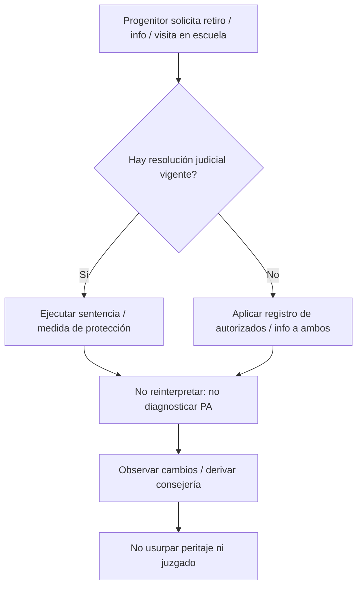

# Capítulo 7.1. Escuela, consejería y logro: el menor entre hogares y aula

<!-- sync:version-badge -->
> **v1.5** · conocimiento **50** · actualizado **2026-09-20**
<!-- /sync:version-badge -->

## Resumen ejecutivo

Búsqueda en **ERIC** (`api.ies.ed.gov/eric`, 2026-09-18): el término estricto *parental alienation* + escuela es **escaso** (~6 hits, con ruido de «alienation syndrome» sociológico). En cambio, el clúster **divorcio/separación × escuela/logro/asistencia/consejería** es denso (**~211**). La lectura educativa útil: el daño escolar se documenta mejor como efecto de **conflicto, transición familiar y lealtad** que como diagnóstico de SAP. Detalle de queries: `metodologia/eric-search-vinculos.json`.

## Pregunta guía

Cuando el vínculo se fractura en casa, ¿qué ve —y qué puede hacer sin usurpar al juzgado— la escuela?

---

## 1. Marco y definiciones

**Ángulo educativo:** asistencia, logro, conducta, apego escolar, consejería y formación docente ante hijos de separación/divorcio o alto conflicto.

**Límite:** la escuela no diagnostica alienación parental; puede **observar** cambios, triangulación y órdenes de custodia/acceso ([@hoffer2002custodyandac]; [[2002-Hoffer-custody-and-access-issues-in-schools-law-matt]]).

**Alienación percibida (clínica-educativa):** Hale et al. asocian percepción adolescente de alienación/rechazo parental con síntomas de ansiedad generalizada ([@hale2006adolescentsp]; [[2006-Hale-adolescents-perceptions-of-parenting-behaviou]]) —no es prueba forense de PA.

---

## 2. Evidencia científica (ERIC)

> **Nivel:** media (revisiones narrativas, estudios escolares, programas); debate PA = polarizado.

### 2.1 Divorcio → escuela (núcleo empírico)

- **NASP / impacto nacional:** Guidubaldi et al. documentan efectos del divorcio parental en niños desde la mirada de la psicología escolar ([@guidubaldi1983theimpactofp]; [[1983-Guidubaldi-the-impact-of-parental-divorce-on-children-re]]).
- **Logro y rendimiento:** Wadsby (logro académico), McCombs (rendimiento adolescente y factores familiares protectores), Molepo (ratings docentes intactos vs. no intactos), Nisivoccia (revisión logro adolescente) ([@wadsby1996academicachi]; [[1996-Wadsby-academic-achievement-in-children-of-divorce]] · [[1989-Mccombs-adolescent-school-performance-following-paren]] · [[2010-Molepo-teacher-ratings-of-academic-achievement-of-ch]] · [[1997-Nisivoccia-the-influence-of-parental-separation-and-divo]]).
- **Intersección hogar–escuela:** Beausang et al. argumentan investigar desde la perspectiva del joven en ambos contextos ([@beausang2012youngpeoplew]; [[2012-Beausang-young-people-whose-parents-are-separated-or-d]]).

### 2.2 Consejería e intervenciones escolares

El consejero escolar es el adulto institucional que ve al menor **entre** hogares: Beekman describe funciones del orientador ante divorcio ([@beekman1986helpingchild]; [[1986-Beekman-helping-children-cope-with-divorce-the-school]]). Connolly et al. sintetizan intervenciones basadas en evidencia en primaria ([@connolly2009evidencebase]; [[2009-Connolly-evidence-based-counseling-interventions-with]]).

**Programas escolares con seguimiento (CODIP y derivados).** Pedro-Carroll y Cowen evalúan el *Children of Divorce Intervention Program* como prevención en escuela ([@anon1985thechildreno]; [[1985-Anon-the-children-of-divorce-intervention-program]]) y extienden intervención preventiva a edad latente ([@anon1986preventivein]; [[1986-Anon-preventive-intervention-with-latency-aged-chi]]). Kalter et al. aportan grupos escolares de facilitación del desarrollo ([@anon1984schoolbasedd]; [[1984-Anon-school-based-developmental-facilitation-group]]). Stolberg y Mahler muestran que entrenamiento en habilidades, participación parental y transferencia **incrementan** beneficios de un grupo de apoyo escolar frente a apoyo solo ([@anon1994enhancingtre]; [[1994-Anon-enhancing-treatment-gains-in-a-school-based-i]]). Wolchik et al., en seguimiento aleatorizado de seis años, reportan menos trastornos, externalización y uso de sustancias con programas para madres y madre+hijo ([@anon2002sixyearfollo]; [[2002-Anon-six-year-follow-up-of-preventive-intervention]]) —persistencia relevante para consejería que no termina con el semestre. Botha y Wild replican CODIP en Sudáfrica: mejoras en conducta y ajuste social/emocional según docentes y padres ([@anon2013evaluationof]; [[2013-Anon-evaluation-of-a-school-based-intervention-pro]]). Ziffer et al. (*Boomerang Bunch*) aportan multifamiliar en escuela ([@ziffer2007theboomerang]; [[2007-Ziffer-the-boomerang-bunch-a-school-based-multifamil]]).

Schmidt (2025) actualiza el paquete «helping children heal» —consejería e intervenciones para sanar tras ruptura familiar, alineado con el eje escuela–trauma ([@schmidt2025helpingchild]; [[2025-Schmidt-helping-children-heal-counseling-intervention]]). Somody et al.: intervención creativa (Paper Bag Books) en familias de **alto conflicto** ([@somody2007paperbagbook]; [[2007-Somody-paper-bag-books-a-creative-intervention-with]]). Experiencias cualitativas de niños ([@anon2023aqualitative]; [[2023-Anon-a-qualitative-study-of-children-s-experiences]]) complementan la mirada clínica sin sustituir protocolo escolar.

### 2.3 Identificación de «alienados» y debate PA

- Calabrese & Adams: identificación de padres/hijos alienados —implicaciones para **psicólogos escolares** ([@calabrese1987theidentific]; [[1987-Calabrese-the-identification-of-alienated-parents-and-c]]).
- Status científico de PA (Harman et al. 2022) vs. crítica a PAD (Pepiton et al. 2012) —ambos indexados en ERIC; la escuela debe conocer la **controversia**, no adoptar un bando como protocolo ([@harman2022developmenta]; [[2022-Harman-developmental-psychology-and-the-scientific-s]] · [[2012-Pepiton-is-parental-alienation-disorder-a-valid-conce]]).

### 2.3b School refusal / problemas de asistencia (diferencial)

La **negativa a asistir** (school refusal / attendance problems) es un síntoma, no un veredicto de alienación. Knollmann et al.: en consulta, school refusal se asocia a trastornos psiquiátricos infantiles/adolescentes —ansiedad, depresión, otros— que la escuela debe derivar, no etiquetar como «campaña» ([@knollmann2009schoolrefus]; [[2009-Knollmann-school-refusal-psychiatric-disorders-childhood]]). Hamadi y Havik: jóvenes describen apoyo profesional «too little, too late» ante problemas de asistencia ([@hamadi2025toolittletoo]; [[2025-Hamadi-Havik-too-little-too-late-school-attendance-problems]]).

**Diferencial operativo (puente [[Cap-03-01-Lealtad-Memoria-Gatekeeping|Capítulo 3.1. Lealtad forzada, manipulación de la memoria y gatekeeping]]):** (1) ansiedad/fobia escolar primaria; (2) depresión / evitación; (3) miedo a un cuidador o IPV; (4) lealtad forzada / gatekeeping que convierte el aula en territorio de un bando; (5) presión de litigio (citas, peritajes, traslados). PubMed no devolvió corpus LATAM×custodia sobre school refusal —la brecha mexicana sigue abierta (§2.6).

### 2.3c Protocolos escolares MX / LATAM (custodia, entrega, información)

La escuela **ejecuta** el título judicial; no lo crea. Marco federal: LGDNNA — NNA de familias separadas tienen derecho a convivencia/contacto regular salvo que el órgano jurisdiccional determine lo contrario al interés superior ([@lgdnna2014convivenci]; [[2014-LGDNNA-Mexico-convivencia-familias-separadas-art23]]).

| Pieza | Qué manda a la escuela |
|-------|------------------------|
| Protocolo ingreso/entrega **CDMX** (AEFCM) ([@aefcm2020protocoloin]; [[2020-AEFCM-protocolo-ingreso-entrega-alumnos-educacion-basica-CDMX]]) | Entrega solo a personas autorizadas en credencial; retardos reiterados → DIF; extravío → Amber/FGJ. Registro de quién recoge ≠ decisión de custodia |
| Guía **Castilla y León** (progenitores no conviven) ([@cyl2021guiacentrodo]; [[2021-CyL-guia-centros-docentes-progenitores-no-conviven]]) | Información a ambos progenitores salvo resolución que lo limite; denuncia/demanda sola no basta para cercenar info; visitas en el centro solo si la sentencia lo autoriza |
| Hoffer (ERIC / derecho escolar) ([@hoffer2002custodyandac]; [[2002-Hoffer-custody-and-access-issues-in-schools-law-matt]]) | Custody/access en escuela: matriz anglófona de issues legales —puente, no protocolo MX |
| Ruiz et al. (ES, participación familia–centro) ([@ruiz2016dificultades]; [[2016-Ruiz-dificultades-de-las-familias-para-participar]]) | Cuando hay litigio, la escuela puede volverse **otro frente** de gatekeeping |

**Regla operativa MX:** (1) pedir copia de sentencia/medidas al expediente escolar; (2) no entregar al «quien llega primero» si hay restricción; (3) no diagnosticar alienación; (4) documentar incidentes para el juzgado, no arbitrar el régimen. Consejería: [[Cap-07-01]] §2.2 —no peritaje ([[Cap-03-05-Evaluacion-Custodia-Forense|Capítulo 3.5. Evaluación de custodia y peritaje forense]]).

#### Mapa de cobertura MX (homologación SEP)

Auditoría 2026-09-20 ([@sep2026gapdivorcioescuela]; [[2026-SEP-gap-homologacion-divorcio-escuela]]): **no** existe circular/acuerdo **SEP federal** específico «divorcio/progenitores separados × información/entrega escolar». Marco residual = LGDNNA + protocolos de entidad/plantel.

| Entidad / nivel | Instrumento en vault | Divorcio×info/entrega | Estado |
|-----------------|----------------------|----------------------|--------|
| **Federal SEP** | — | Homologación específica | **Gap** documentado |
| **Federal** | LGDNNA art. 23 | Convivencia / interés superior | Ancla CDN |
| **CDMX** | AEFCM ingreso/entrega | Entrega a autorizados; no tribunal | **OK** |
| **Guanajuato** | SEG (prensa 2020) | Entrega a familiar avisado; DIF si abandono | Parcial (seguridad ≠ guía divorcio) |
| **Jalisco / NL / Puebla / resto** | — | — | **Pendiente** texto oficial |
| **ES (contraste)** | CyL 2021 | Info a ambos salvo resolución; demanda≠basta | Modelo de claridad |

**Próxima oleada escuela:** circularizar SE de NL, Jalisco, Puebla, Nuevo León, Edomex cuando publiquen; no inventar «protocolo SEP» inexistente.

### 2.4 Educación para coparentalidad (fuera del aula, impacto en hijos)

Programas de divorce/coparenting education y outcomes infantiles ([@crawford2014bufferingneg]; [[2014-Crawford-buffering-negative-impacts-of-divorce-on-chil]] · [[2017-Choi-co-parenting-for-successful-kids-impacts-and]] · [[2022-Becher-divorce-and-predictors-of-child-outcomes-the]] · [[2023-Turner-the-effectiveness-of-online-divorce-education]] · [[2013-Henry-conflict-resolution-strategies-adopted-from-p]]).

### 2.5 Formación docente

Comprensión de futuros maestros sobre hijos de familias divorciadas y autoeficacia ([@atiles2017preservicete]; [[2017-Atiles-preservice-teachers-understanding-of-children]]).

### 2.6 Límites y brecha SciELO / LATAM

- ERIC indexa mucha literatura de consejería/familia; no sustituye cohortes clínicas de PABs ([[Cap-02-02-Evaluacion-Medicion-PABs|Capítulo 2.2. Evaluación y medición: comportamientos parentales alienantes, escalas y peritaje]]).
- «Alienation syndrome» histórico en ERIC ≠ alienación parental contemporánea.
- **Protocolos escolares:** CDMX (entrega) + LGDNNA anclan; **SEP federal sin homologación divorcio×escuela** (gap auditado [@sep2026gapdivorcioescuela]); cobertura multi-entidad aún delgada (Gto parcial; NL/Jal/Puebla pendientes).
- **SciELO / escuela–PA:** capa aún delgada; Portilla-Saavedra y Gomide aportan Chile/Brasil, no protocolos escolares mexicanos de consejería.
- **School refusal × custodia en MX/LATAM:** sin hits PubMed útiles; no inventar tasas.

---

## 3. Falla institucional / sesgo ideológico

- Escuelas que **entregan** al menor al progenitor que llega primero, ignorando órdenes.
- Consejeros que se convierten en **aliados de un bando**.
- Formación docente que patologiza el divorcio o ignora el alto conflicto/IPV.

---

## 4. Impacto en el menor

1. Caídas de logro, asistencia y conducta en la transición.  
2. Triangulación (mensajes, retiro temprano, lealtad).  
3. Aula como posible **refugio** o como escenario del conflicto.  
4. Necesidad de adultos escolares competentes sin rol forense.

---

## 5. Laboratorio literario

El menor cambia de mochila y de reglas dos veces por semana; el pupitre es el único objeto que no elige bando. Ampliar en [[Cap-06-01-Medea-Damnatio-Rehen|Capítulo 6.1. Laboratorio literario: Medea, damnatio memoriae y el menor como rehén]].

---

## 6. Síntesis operativa

1. Protocolo de **custodia/acceso** claro en dirección escolar.  
2. Observar conductas + contexto; no etiquetar SAP.  
3. Consejería breve / grupos / derivación —no peritaje.  
4. Puentes: [[Cap-03-02-Apego-Divorcio-Separacion|Capítulo 3.2. Apego, divorcio y separación parental]] · [[Cap-03-01-Lealtad-Memoria-Gatekeeping|Capítulo 3.1. Lealtad forzada, manipulación de la memoria y gatekeeping]] · [[Cap-03-05-Evaluacion-Custodia-Forense|Capítulo 3.5. Evaluación de custodia y peritaje forense]].

## Mapa de búsqueda ERIC (resumen)

| Query | Hits |
|-------|------|
| título PA / alienating / alienation syndrome | 16 |
| PA × school/academic/teacher | 6 |
| divorce/separation × school/achievement | **211** |
| high-conflict × divorce × school | 5 |
| coparenting × school/education | 16 |
| IPV × custody × school/education | 42 |
| attachment × divorce × school (peer-reviewed) | 13 |

Archivo: `metodologia/eric-search-vinculos.json`.

## Oleada de evidencia (2026-09-19)

| Citekey | Stem | Nivel | Score |
|---------|------|-------|-------|
| [@miralles2021longtermemot] | [[2021-Miralles-long-term-emotional-consequences-of-parental]] | alta | 70 |
| [@anon2002sixyearfollo] | [[2002-Anon-six-year-follow-up-of-preventive-intervention]] | media | 47 |
| [@turner2023theeffective] | [[2023-Turner-the-effectiveness-of-online-divorce-education]] | media | 47 |
| [@little2020romanticrela] | [[2020-Little-romantic-relationship-satisfaction-and-parent]] | media | 36 |
| [@anon2023aqualitative] | [[2023-Anon-a-qualitative-study-of-children-s-experiences]] | media | 35 |
| [@anon2016resiliencean] | [[2016-Anon-resilience-and-rejection-sensitivity-mediate]] | media | 25 |
| [@atiles2017preservicete] | [[2017-Atiles-preservice-teachers-understanding-of-children]] | media | 25 |
| [@anon2013evaluationof] | [[2013-Anon-evaluation-of-a-school-based-intervention-pro]] | media | 25 |
| [@anon1985thechildreno] | [[1985-Anon-the-children-of-divorce-intervention-program]] | media | 25 |
| [@anon2011childrenofdi] | [[2011-Anon-children-of-divorce-the-differential-diagnosi]] | media | 25 |
| [@anon1994enhancingtre] | [[1994-Anon-enhancing-treatment-gains-in-a-school-based-i]] | media | 25 |
| [@beekman1986helpingchild] | [[1986-Beekman-helping-children-cope-with-divorce-the-school]] | media | 25 |
| [@anon1990preschoolage] | [[1990-Anon-preschool-age-children-of-divorce-transitiona]] | media | 25 |
| [@nisivoccia1997theinfluence] | [[1997-Nisivoccia-the-influence-of-parental-separation-and-divo]] | media | 25 |
| [@connolly2009evidencebase] | [[2009-Connolly-evidence-based-counseling-interventions-with]] | media | 25 |
| [@anon2009parentaldivo] | [[2009-Anon-parental-divorce-and-adult-children-s-attachm]] | media | 25 |
| [@anon1978medicalpsych] | [[1978-Anon-medical-psychologic-and-legal-aspects-of-chil]] | media | 25 |
| [@tas2019schoolattach] | [[2019-Tas-school-attachment-and-video-game-addiction-of]] | media | 25 |
| [@wadsby1996academicachi] | [[1996-Wadsby-academic-achievement-in-children-of-divorce]] | media | 25 |
| [@ziffer2007theboomerang] | [[2007-Ziffer-the-boomerang-bunch-a-school-based-multifamil]] | media | 25 |
| [@becher2022divorceandpr] | [[2022-Becher-divorce-and-predictors-of-child-outcomes-the]] | media | 25 |
| [@adams1989theeffectsof] | [[1989-Adams-the-effects-of-divorce-on-achievement-behavio]] | media | 25 |
| [@anon1984schoolbasedd] | [[1984-Anon-school-based-developmental-facilitation-group]] | media | 25 |
| [@anon2003parentalalig] | [[2003-Anon-parental-alignments-and-rejection-an-empirica]] | media | 25 |
| [@anon1986preventivein] | [[1986-Anon-preventive-intervention-with-latency-aged-chi]] | media | 25 |

## Fuentes integradas (núcleo en prosa)

- Logro / escuela: [@guidubaldi1983theimpactofp] · [@wadsby1996academicachi] · [@beausang2012youngpeoplew] · [@molepo2010teacherratin] —ver FM completo.
- Consejería / programas escolares: [@beekman1986helpingchild] · [@connolly2009evidencebase] · [@anon1985thechildreno] · [@anon1986preventivein] · [@anon1984schoolbasedd] · [@anon1994enhancingtre] · [@anon2002sixyearfollo] · [@anon2013evaluationof] · [@schmidt2025helpingchild] · [@ziffer2007theboomerang] · [@somody2007paperbagbook]
- PA / controversia escolar: [@calabrese1987theidentific] · [@harman2022developmenta] · [@hale2006adolescentsp]
- Coparentalidad / educación: [@crawford2014bufferingneg] · [@turner2023theeffective] · [@atiles2017preservicete]

## Enlaces relacionados

- [[Cap-03-02-Apego-Divorcio-Separacion|Capítulo 3.2. Apego, divorcio y separación parental]]
- [[Cap-02-01-Trauma-Ruptura-Vinculo|Capítulo 2.1. Trauma de ruptura forzada: apego, estrés y neurodesarrollo]]
- [[MOC-Evidencia]]
- [[ficha-tecnica-obra]]

<!-- sync:mermaid-boot -->

<!-- /sync:mermaid-boot -->
